# Pipeline Incremental Loading - Proposal Design

## Issue 1: Incremental Loading Not Functional

### Problem Statement

The current pipeline does not support true incremental loading. Each partition is fully reloaded on every run.

The delta calculation logic compares `ingested_at` against `updated_at` to identify records that need processing. However, **the `ingested_at` timestamp is never updated at the end of the pipeline execution**. This means:

- The delta calculation always returns the same set of records
- Every pipeline run reprocesses the entire partition instead of only new/modified data
- This results in unnecessary computation and resource consumption

### Proposed Solution

Update the `ingested_at` timestamp at the end of a successful pipeline run to reflect the processing completion time. This will ensure subsequent runs correctly identify only new or modified records for processing.

### Diagram: Current Behavior (Broken)

```mermaid
flowchart TB
    subgraph Run1["Run 1"]
        T0_1["ingested_at = T0"]
        D1["Delta Calc: updated_at > T0"]
        R1["All records processed"]
        T0_1 --> D1 --> R1
    end

    subgraph Run2["Run 2"]
        T0_2["ingested_at = T0 ⚠️ unchanged"]
        D2["Delta Calc: updated_at > T0"]
        R2["All records processed AGAIN"]
        T0_2 --> D2 --> R2
    end

    subgraph Run3["Run 3"]
        T0_3["ingested_at = T0 ⚠️ unchanged"]
        D3["Delta Calc: updated_at > T0"]
        R3["All records processed AGAIN"]
        T0_3 --> D3 --> R3
    end

    Run1 --> Run2 --> Run3

    style T0_2 fill:#ffcccc,color:#000
    style T0_3 fill:#ffcccc,color:#000
    style R2 fill:#ffcccc,color:#000
    style R3 fill:#ffcccc,color:#000
```

### Diagram: Proposed Behavior (Fixed)

```mermaid
flowchart TB
    subgraph Run1["Run 1"]
        T0["ingested_at = T0"]
        D1["Delta Calc: updated_at > T0"]
        R1["Records T0→T1 only"]
        U1["Update ingested_at = T1 ✅"]
        T0 --> D1 --> R1 --> U1
    end

    subgraph Run2["Run 2"]
        T1["ingested_at = T1"]
        D2["Delta Calc: updated_at > T1"]
        R2["Records T1→T2 only"]
        U2["Update ingested_at = T2 ✅"]
        T1 --> D2 --> R2 --> U2
    end

    subgraph Run3["Run 3"]
        T2["ingested_at = T2"]
        D3["Delta Calc: updated_at > T2"]
        R3["Records T2→T3 only"]
        U3["Update ingested_at = T3 ✅"]
        T2 --> D3 --> R3 --> U3
    end

    Run1 --> Run2 --> Run3

    style U1 fill:#ccffcc,color:#000
    style U2 fill:#ccffcc,color:#000
    style U3 fill:#ccffcc,color:#000
```

---

## Issue 2: Germline SNV Occurrence Table - Incremental Loading Incompatibility

### Problem Statement

If incremental loading is enabled (Issue 1), the `germline_snv_occurrence` table loading will produce data integrity errors.

**Current behavior:**
- The `variant_tmp` table is used to map variant IDs to locus hashes
- `variant_tmp` is loaded **incrementally** (delta only)
- `germline_snv_occurrence` is loaded from Iceberg tables for the **entire partition**

**Consequences:**
1. **Data errors**: When loading the full partition into `germline_snv_occurrence`, the join with `variant_tmp` will fail for records outside the delta, resulting in `NULL` values for `locus_id` and causing insertion failures
2. **Performance degradation**: Reading the entire partition from Iceberg tables is inefficient when only the delta needs processing

### Proposed Solution

Implement a **two-phase loading strategy** using a temporary partition:

1. **Phase 1 - Copy existing data**: Copy records from the current partition that are **not** part of the delta (unchanged records)
2. **Phase 2 - Insert delta**: Process and insert only the new/modified records (delta) from Iceberg

### Benefits

| Aspect | Current State | Proposed State |
|--------|---------------|----------------|
| Data read from Iceberg | Entire partition | Delta only |
| Performance | Full partition scan | Incremental processing |
| Data integrity | Risk of NULL locus_id | Consistent mapping |
| Iceberg table lifecycle | Data accumulates | Can be used as a buffer and cleaned frequently |
| Cost | Higher (full reads) | Lower (reduced I/O + storage savings) |

### Additional Benefit

With this approach, **Iceberg tables can be treated as a temporary staging buffer** rather than a persistent data store. This enables regular cleanup of processed data, resulting in significant storage cost savings.

### Diagram: Current Behavior (Broken with Incremental Loading)

```mermaid
flowchart TB
    subgraph Current["Current Behavior ⚠️"]
        VT["variant_tmp<br/>(DELTA ONLY)<br/>100 records"]
        ICE["Iceberg Table<br/>(FULL PARTITION)<br/>10,000 records"]
        GSO["germline_snv_occurrence"]
        ERR["❌ INSERT FAILURE<br/>9,900 records have NULL locus_id"]

        VT --> |"JOIN"| J["Join Operation"]
        ICE --> J
        J --> GSO
        GSO --> ERR
    end

    style ERR fill:#ffcccc,color:#000
    style VT fill:#ffffcc,color:#000
    style ICE fill:#ffffcc,color:#000
```

### Diagram: Proposed Behavior (Two-Phase Loading)

### Performance Comparison

```mermaid
flowchart LR
    subgraph Current["Current Approach"]
        C1["Read from Iceberg"]
        C2["10,000 records"]
        C3["Iceberg = Permanent Storage 💰💰💰"]
        C1 --> C2 --> C3
    end

    subgraph Proposed["Proposed Approach"]
        P1["Read from Iceberg"]
        P2["100 records"]
        P3["Iceberg = Buffer (cleanable) 💰"]
        P1 --> P2 --> P3
    end

    style C2 fill:#ffcccc,color:#000
    style C3 fill:#ffcccc,color:#000
    style P2 fill:#ccffcc,color:#000
    style P3 fill:#ccffcc,color:#000
```

---

## Issue 3: Deleted Tasks Not Handled in Incremental Loading

### Problem Statement

The current pipeline does not handle **task deletions**. When a task (sequencing experiment) is deleted from the source system, the associated data **remains in the `germline_snv_occurrence` table**, leading to stale/orphaned data.

### Scope Analysis

| Table | Impact | Action Required |
|-------|--------|-----------------|
| `germline_snv_occurrence` | **Affected** - Orphaned records remain | Needs deletion handling |
| `raw_exomiser` | **Affected** - Orphaned records remain | Needs deletion handling |
| `variant` tables | **Not affected** - Only variants with `freq > 0` are retained | No action needed |
| `consequence` table | **Not affected** - Used for annotation purposes only | No cleanup needed |

### Proposed Solution

Implement a **three-step deletion handling process**:

#### Step 1: Flag Deleted Tasks
- Update `staging_sequencing_experiment` to include a **`deleted` flag**
- This flag identifies tasks that have been removed from the source system

#### Step 2: Exclude Deleted Tasks During Data Copy
- During the `germline_snv_occurrence` and `raw_exomiser` table updates (Phase 1 from Issue 2 - copying existing data), **exclude records associated with deleted task IDs**
- This ensures orphaned data is naturally purged during the incremental loading process

#### Step 3: Cleanup Staging Table
- At the end of the pipeline, **delete rows where `deleted = true`** from `staging_sequencing_experiment`
- This keeps the staging table clean and prevents reprocessing of already-handled deletions

### Integration with Issue 2

This solution integrates seamlessly with the two-phase loading strategy proposed in Issue 2:

1. **Phase 1 - Copy existing data**: Copy records that are NOT part of the delta **AND NOT associated with deleted task IDs**
2. **Phase 2 - Insert delta**: Process and insert new/modified records
3. **Final step**: Purge deleted flags from staging

### Diagram: Deletion Handling Flow

### Diagram: Complete Pipeline Flow with Deletion Handling

---

## Implementation Roadmap

The following task breakdown allows incremental development without breaking the existing pipeline.

### Overview

---

### Phase 0: Schema Preparation (Non-Breaking)

| Task | Description | Risk | Notes |
|------|-------------|------|-------|
| **T0** | Add `deleted` boolean column to `staging_sequencing_experiment` | None | Default value `false`, backward compatible. Existing code unaffected. |

---

### Phase 1: Two-Phase Loading (Issue 2)

| Task | Description | Risk | Notes |
|------|-------------|------|-------|
| **T1A** | Implement two-phase loading for `germline_snv_occurrence` | Low | Can be tested in parallel with current behavior. Replaces current INSERT with: (1) COPY existing non-delta records, (2) INSERT delta. |
| **T1B** | Implement two-phase loading for `raw_exomiser` | Low | Same approach as T1A. |

**Why this is safe:** The pipeline still processes the full partition (ingested_at unchanged), but uses the new loading mechanism. Functionally equivalent, just more efficient architecture.

---

### Phase 2: Deletion Handling (Issue 3)

| Task | Description | Risk | Notes |
|------|-------------|------|-------|
| **T2A** | Implement deletion detection logic | None | Sets `deleted = true` flag but doesn't act on it yet. Safe to deploy independently. |
| **T2B** | Modify Phase 1 copy to exclude deleted task IDs | Low | Requires T1A/T1B and T2A. Adds `WHERE task_id NOT IN (deleted_tasks)` filter. |
| **T2C** | Add cleanup step: `DELETE WHERE deleted = true` | Low | Runs at end of pipeline after all tables processed. |

**Why this is safe:** T2A can be deployed without T2B/T2C. The flag is set but ignored until exclusion logic is ready.

---

### Phase 3: Activation (Issue 1)

| Task | Description | Risk | Notes |
|------|-------------|------|-------|
| **T3** | Update `ingested_at` at end of successful pipeline run | Medium | **This is the activation switch.** Only deploy after all previous phases are validated. |

**Why this must be last:** Once `ingested_at` is updated, the pipeline will only process deltas. All delta-handling logic (Issues 2 & 3) must be in place first.

---

### Summary: JIRA Tickets

| Ticket    | Title | Depends On | Phase |
|-----------|-------|------------|-------|
| SJRA-1189 | Add `deleted` column to staging_sequencing_experiment | - | 0 |
| SJRA-1190 | Implement two-phase loading for germline_snv_occurrence | - | 1 |
| SJRA-1191 | Implement two-phase loading for raw_exomiser | - | 1 |
| SJRA-1192 | Implement task deletion detection | Phase 0 | 2 |
| SJRA-1193 | Exclude deleted tasks during data copy | Phase 1, T2A | 2 |
| SJRA-1194 | Add cleanup step for deleted task flags | T2B | 2 |
| SJRA-1195 | Enable incremental loading (update ingested_at) | Phase 1, Phase 2 | 3 |

---
