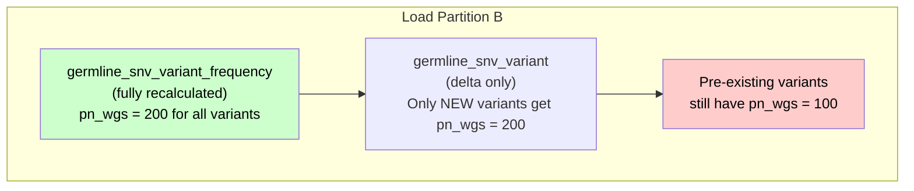

# Frequency Update for Existing Variants - Proposal Design

## Problem Statement

When new partitions are loaded, the `germline_snv_variant` table is updated using a delta strategy: only new or changed variants are inserted. However, frequency-related columns (`pn_wgs`, `pc_wgs`, `pf_wgs`, etc.) are derived from the `germline_snv_variant_frequency` table, which is fully recalculated on each load.

This means that **pre-existing variants retain stale frequency values** even though the cohort size (`pn`) and participant frequencies (`pf`) have changed with the addition of new participants.

### Example

1. Partition A is loaded: variant X gets `pn_wgs = 100`, `pf_wgs = 0.05`
2. Partition B is loaded: the cohort grows to 200 participants
3. `germline_snv_variant_frequency` is recalculated: variant X now has `pn_wgs = 200`, `pf_wgs = 0.025`
4. `germline_snv_variant` only processes the delta — variant X is **not updated** and still shows `pn_wgs = 100`, `pf_wgs = 0.05`

### Current Flow



## Proposed Solutions

### Option 1: Partial update from frequency table

Split the `germline_snv_variant` update into two steps:

**Step 1 — Delta insert (without frequencies):**

Insert new/changed variants into `germline_snv_variant` with frequency columns left empty (default to 0).

**Step 2 — Full frequency update:**

Update all frequency columns for all variants in `germline_snv_variant` from `germline_snv_variant_frequency` using a StarRocks partial column update:

```sql
INSERT INTO germline_snv_variant (locus_id, pc_wgs, pn_wgs, pf_wgs, pc_wgs_affected, pn_wgs_affected, pf_wgs_affected, ...)
SELECT locus_id, pc_wgs, pn_wgs, pf_wgs, pc_wgs_affected, pn_wgs_affected, pf_wgs_affected, ...
FROM germline_snv_variant_frequency;
```

> Note: StarRocks supports partial column updates via `INSERT INTO table (col1, col2, ...) SELECT ...` on Primary Key tables. Only the specified columns are updated for matching keys; other columns remain unchanged.

**Pros:**
- Simple to implement
- Guarantees that all variants have up-to-date frequency values after each load

**Cons:**
- Performance to monitor as data grows — the entire frequency table is scanned and written on every load

### Option 2: Move pn and pf computation to the API layer

Keep only `pc` (participant count) in the frequency tables and compute `pf` (participant frequency) at query time in the API.

**Pipeline changes:**

- `germline_snv_staging_variant_frequency` and `germline_snv_variant_frequency`: only store `pc_*` columns, remove `pn_*` and `pf_*` columns
- `germline_snv_variant`: only store `pc_*` columns for frequencies
- Store `pn` values in a dedicated single-row table (e.g. `germline_snv_participant_count`):

```sql
CREATE TABLE germline_snv_participant_count (
    pn_wgs              INT,
    pn_wgs_affected     INT,
    pn_wgs_not_affected INT,
    pn_wxs              INT,
    pn_wxs_affected     INT,
    pn_wxs_not_affected INT
);
```

- This table is updated on each pipeline run with the current cohort totals.

**API changes:**

- On query, the API fetches `pn` values from `germline_snv_participant_count` (cached)
- `pf` is computed at query time: `pf = pc / pn`

```
API Request → Cache lookup for pn → Query variants (pc only) → Compute pf = pc / pn → Response
```

**Pros:**
- Delta-only updates in the pipeline — no need to update all variants on each load
- `pn` is guaranteed to be consistent across all variants (single source of truth)
- Simpler frequency tables (fewer columns to maintain)
- Lighter pipeline workload

**Cons:**
- Requires API changes (fetching `pn`, computing `pf`, cache management)
- Adds computation at query time (though `pf = pc / pn` is trivial)
- Introduces a cross-table dependency at the API layer
- For users querying the database directly (data analysts, AI agents), frequency computation is no longer straightforward — they must join with the participant count table and compute `pf` manually instead of reading it directly from the variant table
- The delta must also account for variants whose occurrences have been deleted — their `pc` values need to be recalculated, adding complexity to the delta logic

## Decision

**Option 1** is selected. It is simpler to implement and keeps all frequency logic within the pipeline. Performance will be monitored as data grows — if it becomes a bottleneck, Option 2 can be revisited.
