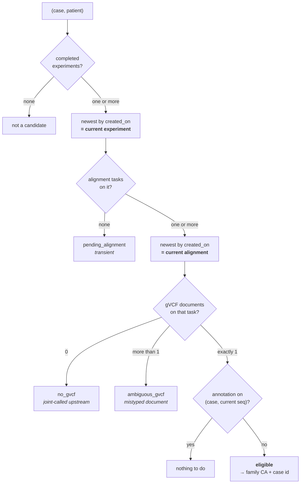

# Automating Nextflow post-processing — specification

**Status:** implemented on `feat/sjra-1698`. Behaviour is settled; the technical detail is deliberately
left to the developer. The closing section lists what is still open.

**Audience:** dev, QA, product owner.

**Related:** `SJRA-1843-nextflow-postprocessing-from-cases.md` (the DAG this automates — read §3,
§10 and annex D before starting), `SJRA-867-task-based-processing.md` (the `task` / `task_context`
model and the "one task, several cases" trade-off), `radiant/dags/docs/nextflow_postprocessing_cases.md`
(the operator runbook).

**Related ticket:** SJRA-1698.

---

## 1. Why

`radiant-nextflow-postprocessing-cases` already closes both ends around the Ferlab
post-processing pipeline. It turns a list of case ids into a samplesheet, PED files and
phenopackets, triggers `radiant-nextflow-postprocessing`, then registers what the run published
back onto the cases as `radiant_germline_annotation` and `exomiser` tasks.

What it does not do is decide *which* cases. Someone has to notice that sequencing has landed,
work out which cases are still waiting for an annotation, and paste a list of ids into the trigger
form. That step is the only manual one left, it is the one that scales worst, and it is the one
most likely to be forgotten — a case that nobody notices simply never gets annotated, and nothing
in the system says so.

This specification removes it. The DAG finds its own work by asking the clinical model a single
question: **which sequencing has been aligned but never annotated?**

Answering that question honestly forces a second decision the manual DAG could defer — what to do
when a patient has more than one sequencing experiment in a case. §5 takes it, because under
automation it is no longer a data-quality footnote: it decides whether the DAG converges at all.

## 2. What changes, in one table

| | Today | After |
|---|---|---|
| Input | `case_ids`, mandatory | `task_ids`, optional — empty means "find them" |
| Schedule | `None` (manual only) | daily |
| Tenants per run | exactly one, enforced | any number, one batch PATCH each |
| A case that cannot be resolved | fails the whole run | excluded, with a reason, run continues |
| A member with two sequencing experiments | wrong PED (parent) or misleading error (proband) | most recent wins, the discarded one is reported |
| Two alignment tasks on one experiment | rejected, with a message naming the wrong cause | most recent wins |
| `dry_run` default | `true` | `false` |

Everything else — the samplesheet writer, the PED and phenopacket writers, the pipeline trigger,
the output collection, the shape of the registration payload — is unchanged. This is a change to
*how the DAG is given work*, not to what it does with it.

```
discover_scope ──> fetch_members ----+
   (SQL)                             +-> resolve_cases -> generate_inputs -> run_pipeline
                 fetch_phenotypes ---+                                            |
                                          register_tasks <- collect_outputs
                                        (mapped, one per tenant)
```

## 3. The signal: aligned but not annotated

A unit of work is a **`(case, sequencing_experiment)` pair**. It is eligible when the pair's
current experiment has an alignment publishing a gVCF, and no `radiant_germline_annotation` task
is scoped to that same pair.

```
eligible(case) :=
      cases.case_type_code = 'germline'
  AND cases.status_code IN ('in_progress', 'completed')
  AND EXISTS patient IN family(case) SUCH THAT
          seq := current(case, patient)                          -- §5
      AND current_alignment(seq) publishes a gVCF                -- §5
      AND NOT EXISTS ( radiant_germline_annotation task,
                       task_context ON sequencing_experiment_id = seq
                                   AND case_id = case )
```

Two asymmetries in the model make this work, and both are easy to get silently wrong.

**Alignment tasks carry no case.** In `task_context`, every `alignment_germline_variant_calling`
row has `case_id = NULL` (`radiant/dags/sql/clinical/seeds.sql:996-1056`). An alignment task
attaches to a *sequencing experiment*, not to a case; the case comes from
`case_has_sequencing_experiment`. A query that joins alignment tasks to cases through
`task_context.case_id` returns nothing at all — not an error, just an empty set. This is why
`case_members_select.sql` already reaches the gVCF through `task_context.sequencing_experiment_id`
and never through `case_id`.

**Annotation tasks do carry a case.** `task_context.case_id` is populated for
`radiant_germline_annotation` (seeds `(63, 1, 1..3)`), because registration knows which case it is
writing to. That is what keeps the negative side of the anti-join case-scoped, and it is
load-bearing for §4: an annotation registered on case 1 must not make case 2 look done.

**The `cases.status_code` filter is not cosmetic.** A case marked `revoke` is, in practice, very
often exactly a case that was left without an annotation on purpose. Without this filter the
nightly job would resurrect every one of them, every night. `staging_external_sequencing_experiment`
already applies the same filter for the same reason.

**Granularity is the pair, not the case.** A case whose duo was annotated last month becomes
eligible again when the father's alignment lands, because the father's pair has no annotation.
That is the intended behaviour — the "duo becomes trio" scenario of SJRA-1843 annex D, which the
pipeline supports and which appends a second annotation task alongside the first. Judging
eligibility per case instead would leave those cases stranded forever.

## 4. One alignment task, several cases

This is named as a corner case to handle. It needs no special handling, but it does need to be
understood, because the usual phrasing hides what is actually happening.

There is no such thing as "an alignment task belonging to two cases" — alignment tasks belong to
no case at all (§3). What exists is **one sequencing experiment linked to two cases** through two
rows of `case_has_sequencing_experiment`. The shared task is a consequence, not the cause.

Once that is seen, the behaviour falls out of the existing design:

- the experiment yields two eligible pairs, `(case 1, seq)` and `(case 2, seq)`, so **two cases**
  enter the run;
- each case is its own family — `familyId = CA{case_id}`, its own PED, its own phenopacket, its
  own rows in the samplesheet. The two families reference the same gVCF file, which is correct: the
  pipeline joint-calls each family independently;
- outputs cannot collide, because every path in `OUTPUT_SPEC` is keyed on `{family_id}`;
- registration produces **two `radiant_germline_annotation` tasks and two `exomiser` tasks**, one
  pair per case, whose `input_documents` legitimately name the same gVCF URLs.

Worked through: an alignment shared by case 1 and case 2 gives one pipeline run containing
families `CA1` and `CA2`, and two annotation tasks. The only reason this needs a section is that
anyone writing the query from the informal wording will reach for `task_context.case_id` and get
an empty result.

The two cases need not belong to the same tenant. §9 covers that.

## 5. Superseded sequencing: newest wins

A patient can have more than one sequencing experiment linked to the same case — re-sequenced
after a contamination or a QC failure, most often. SJRA-1843 recorded this as a known gap and
deferred it, on the grounds that "newest wins" is a policy about superseded data that should be
decided once. **This document takes that decision**, because automation cannot defer it.

### 5.1 Why it stops being optional

`case_members_select.sql` returns one row per `(member, sequencing experiment)`. Two experiments
for one member therefore produce two rows, and today:

- if that member is the **proband**, the "expected exactly 1 proband" assertion fires — safe, but
  the message names the wrong cause;
- if that member is a **parent**, nothing catches it. The run produces a four-row samplesheet, a
  four-person PED, and joint genotyping over an individual who does not exist. Silent and wrong.

Under automation nobody reads the samplesheet, so the silent case stays silent. But there is a
harder problem than plausibility, and it is what makes this a convergence requirement rather than
a quality improvement:

> If the eligibility query considers **every** alignment-bearing experiment while resolution
> builds the family from only **one**, the discarded experiment has an alignment and no annotation
> forever. The case is re-discovered every night and the pipeline re-runs it every night.

Selection must therefore be **identical on both sides of the anti-join**. That is not a preference;
a mismatch is a livelock.

### 5.2 The rule

```
current(case, patient) :=
    the sequencing_experiment linked to `case` whose sample belongs to `patient`,
    with status_code = 'completed',
    ordered by created_on DESC, id DESC — first row

current_alignment(seq) :=
    the alignment_germline_variant_calling task whose task_context covers `seq`,
    ordered by created_on DESC, id DESC — first row
```

One experiment per `(case, patient)`, one alignment task per experiment. The same definition feeds
the eligibility query and the family builder, so a superseded experiment is invisible to both.

Two properties follow, and both are the point of the rule:

- **A discarded experiment never keeps a case eligible.** No livelock.
- **`resolve_families` can no longer see a duplicate member.** The proband assertion still exists,
  but it now means what it says — two *different patients* marked proband, a genuine data error —
  rather than firing on a re-sequenced one. Annex D's "safe but misleading" and "silent and wrong"
  cases close together, under one rule.

**Only `completed` experiments are annotable.** This is a whitelist, not a `revoke` blacklist: a
sequencing that is not finished is not a candidate, whatever the reason.

**Selection is reported, never silent.** Every time an experiment or an alignment task is
discarded, the run log names both the kept and the discarded id. Beyond the log, the registered
`radiant_germline_annotation` task's `input_documents` name the gVCFs actually used, so which
sample fed an analysis stays recoverable from the portal without reading Airflow.

### 5.3 The two use cases, worked through

**Sequential — the re-sequencing arrives after an annotation exists.**

Day 1: case 1 holds proband P (seq1), father F (seq3), mother M (seq4). The DAG runs and registers
annotation `A1` over aliquots `{seq1, seq3, seq4}`.

Day 2: seq2 arrives for P and is linked to the case. `current(case1, P)` becomes seq2. The pair
`(case 1, seq2)` has an alignment and no annotation, so the case is eligible again. The run builds
the family from `{P via seq2, F via seq3, M via seq4}` and registers `A2` over `{seq2, seq3, seq4}`.

`A1` is not deleted or superseded — it sits alongside, exactly as SJRA-1843 §11 describes, and the
portal serves both through `tasks_with_occurrences` with their `created_on`. seq1 is no longer
current, so nothing re-triggers on it. The case converges.

Note that F and M are re-annotated too, even though nothing changed for them. That is correct
rather than wasteful: a joint call over a different proband sample is a different result for every
member of the family. A family is one unit of analysis, not three.

**Simultaneous — two experiments, no annotation yet.**

Day 1: case 1 holds P with both seq1 and seq2, neither annotated. `current(case1, P)` is seq2. The
run builds one family, registers one annotation over seq2, and never considers seq1 again. One
pipeline run, one annotation, converged.

### 5.4 Why not the alternatives

**Annotate both.** Two pipeline runs for the same case, one per experiment, two annotation tasks.
It converges too — pair-level anti-join handles it — so the objection is not correctness. It is
that both runs share `familyId = CA{case_id}`, so they cannot be one samplesheet and must be two
full runs, doubling WGS compute and re-joint-calling the parents twice. And at the end the
clinician sees two analyses of the same case with nothing to say that one rests on the sample the
lab rejected. That exports the decision to the person with the least information about it. If a
site genuinely wants both analysed, the modelling answer is two cases, not two annotations on one.

**Exclude and report.** Reuse §8's mechanism with a `duplicate_sequencing` reason and let a human
revoke or unlink the stale experiment. Never wrong, never converges either: the case stays
un-annotated until someone acts, which is the manual step this document exists to remove. It stays
available as a fallback if §5.5 shows that `status_code` cannot be trusted.

### 5.5 The seed data needs updating

The whitelist has no consequence in production, but it does for the tests: only 4 of the 273
seeded sequencing experiments are `completed`, and all four already carry an annotation, so the
eligible set over the current seeds is empty. `radiant/dags/sql/clinical/seeds.sql` needs rows
covering the cases §14 exercises before any of it can pass. Fixture work, not a design question.

### 5.6 The same rule for re-alignment

The identical policy applies to the other half of annex D: a sequencing experiment re-aligned
after an error carries two `alignment_germline_variant_calling` tasks and two gVCF URLs. Today
that is `gvcf_matches = 2`, rejected with a message blaming a mistyped document.

Taking the newest alignment task by `task.created_on` fixes it, and has a valuable side effect —
it finally separates the two causes that `gvcf_matches` conflates:

| Shape | Cause | Behaviour |
|---|---|---|
| Two gVCF documents on **two** alignment tasks | re-alignment; the older is superseded | newest task wins, logged, run continues |
| Two gVCF documents on **one** alignment task | a document is mistyped at the source — typically an index recorded with `format_code = 'gvcf'` | excluded as `ambiguous_gvcf`, with the message that is now actually true |

One policy, two applications, and the error message stops misdirecting.

## 6. Use cases at a glance

The rules in §3–§5 compose; the six shapes below are what they compose *into*. Rows 4 to 6 are the
ones the manual DAG got wrong, and rows 5 and 6 are the ones that would have kept the automation
re-running the same case every night.

| # | Shape in the clinical model | Current selection (§5) | Eligible pairs | What the run produces |
|---|---|---|---|---|
| 1 | **Happy path.** Solo case, proband with one `completed` experiment, one alignment, no annotation | seq1 via T1 | `(C, seq1)` | family `CA{C}` with one sample → 1 annotation + 1 exomiser |
| 2 | **Family completed.** Duo already annotated; the father's experiment and alignment arrive | seq1, seq2, seq3 | `(C, seq3)` only | a family of **three** — the whole family is re-joint-called → A2 over all three, A1 survives beside it |
| 3 | **Shared experiment.** One experiment linked to two cases, one alignment, no annotation | seq1, for both cases | `(C1, seq1)`, `(C2, seq1)` | **one** pipeline run, families `CA1` + `CA2` naming the same gVCF → 2 annotations + 2 exomiser |
| 4 | **Re-sequenced after annotation.** Annotated trio, then the proband is re-sequenced | seq2 replaces seq1 | `(C, seq2)` | family = P(seq2), F, M → A2 over the new set; A1 stays queryable; seq1 never re-triggers |
| 5 | **Re-sequenced before annotation.** Two `completed` experiments for one patient, no annotation at all | seq2 (newest); seq1 invisible | `(C, seq2)` | one family, one annotation. seq1 is never eligible, so the case converges instead of re-running nightly |
| 6 | **Re-aligned.** One experiment, two alignment tasks, one gVCF each | seq1 via T2 (newest task) | `(C, seq1)` | the run proceeds on T2's gVCF. Two gVCFs on the *same* task instead → `ambiguous_gvcf`, excluded (§5.6) |

Read left to right, every row is the same decision applied twice — once to pick the experiment,
once to pick its alignment — and then a single question about annotation:



The family that reaches the samplesheet is always built from `current(case, patient)` for **every**
member, not only the member whose pair triggered eligibility — which is why row 2 re-annotates the
mother and row 4 re-annotates both parents. A joint call is one result over one family, not a set
of independent per-member results.

## 7. Input contract: `task_ids`, discovery when absent

The DAG's parameter becomes **`task_ids`** — `alignment_germline_variant_calling` task ids — and
the DAG resolves task → sequencing experiments → cases itself. Everything downstream stays per
case; only the conversion moves earlier.

The parameter is **optional**:

- **empty** — discover every eligible pair. This is what a scheduled run does, and it is the
  "no input param" the automation asks for;
- **non-empty** — restrict discovery to those tasks. This preserves the targeted manual rerun,
  which is what makes the DAG debuggable and what the first backfill (§10) needs.

Both paths run the same query and produce the same shape, so there is one code path, not two.
Discovery and scope resolution therefore collapse into a **single new SQL template** under
`radiant/dags/sql/clinical/`, with a Jinja conditional adding the `task_id IN %(task_ids)s`
predicate only when a list was supplied — Jinja renders before parameter binding, so this composes
cleanly with the driver's `%`-doubling rule (SJRA-1843 annex C).

**The current-experiment selection of §5 must be defined once and consumed by both queries.** The
discovery query decides which `(case, sequencing_experiment)` pairs are current; the members query
must build families from exactly those pairs rather than re-deriving them from `case_ids`, or the
two definitions will drift and §5.1's livelock returns through the back door. Whether that is a
pair list passed as a parameter or a shared CTE is the developer's call; that there is a single
definition is not.

> **Assumption to confirm in review.** Discovery lives *inside* this DAG rather than in a separate
> scheduling DAG that triggers it. One DAG is simpler to reason about and makes the run's scope
> visible in the same log as the run itself; the alternative buys nothing here because the
> existing `max_active_runs = 1` is already the whole concurrency story (§10).

## 8. Ineligible candidates are excluded and reported, never fatal

Today every validation failure in `resolve_families` fails the entire run. That is the right
answer for a hand-typed list — an operator asked for a specific case and deserves to be told it is
impossible. It is the wrong answer for a nightly job, where one unfixable row would block every
other case for as long as it takes someone to notice.

**The discovery query emits one row per candidate with an `exclusion_reason` column**, `NULL`
meaning eligible. The report is then a by-product of the query rather than a second mechanism that
can drift away from it. The DAG logs every excluded case with its reason and continues with the
rest.

| `exclusion_reason` | Meaning |
|---|---|
| `pending_sequencing` | the member has no `completed` sequencing experiment yet — transient and expected, not an error |
| `pending_alignment` | the member's current experiment has no alignment task yet — likewise transient |
| `no_gvcf` | the current alignment task published no gVCF — the case was joint-called upstream, out of scope (§11) |
| `ambiguous_gvcf` | the current alignment task published more than one gVCF document — mistyped at the source (§5.6) |
| `proband_count` | not exactly one proband row after selection — now genuinely two patients marked proband (§5.2) |
| `unsupported_strategy` | a strategy outside `{wgs, wxs, wes}`, or several within one case |
| `no_project_code` | the batch PATCH looks a case up by `(project_code, submitter_case_id)`; without it registration cannot address the case |
| `tenant_not_granted` | the case's tenant is not in the configured allow-list (§9) |

The `pending_*` reasons deserve their own codes rather than being folded into `no_gvcf`. Under
automation a transient state that looks like an error trains people to ignore the report. It is
also the correct behaviour for §5's rule: when a member's newest experiment has no alignment yet,
the case *waits* rather than running against the superseded one and producing an annotation that
is obsolete the moment it lands.

A member whose two experiments differ in `experimental_strategy_code` needs no new reason. Newest
wins picks one, and if that leaves the case spanning several strategies it is caught by
`unsupported_strategy` — which is the right answer, because that is not a re-sequencing.

Exclusion is **at case granularity**: if any member of a case is excluded, the whole case is,
because the pipeline joint-calls whole families and a family missing a member is not a smaller
job, it is a different one.

`resolve_families` keeps all of its assertions and gains a mode:

- **strict** — ids were supplied explicitly, so a problem is an error the operator must see;
- **lenient** — the scope was discovered, so a problem drops the case and is reported.

The alternative, dropping the assertions because discovery already filters, is rejected: the two
sets of predicates would drift, and the day they disagree the failure is a wrong samplesheet
rather than an error. Lenient mode is a backstop behind the query, not a replacement for it.

## 9. Multi-tenant runs, one batch per tenant

A run may span tenants. The current single-tenant restriction comes from exactly one place — the
batch endpoint is `PATCH /{tenant}/cases/batch`, one tenant per call. Everything else is already
tenant-blind: the clinical tables are a single shared schema behind `radiant_jdbc` with
`tenant_code` as an attribute, `cases.id` is globally unique, `familyId = CA{case_id}` inherits
that uniqueness, and the pipeline neither knows nor needs to know.

Keeping the restriction would mean one run per tenant, and because `radiant-nextflow-postprocessing`
is `max_active_runs = 1`, those runs serialise. On WGS that is hours of queueing bought for
nothing.

So:

- `resolve_cases` drops its "the requested cases span several tenants" rejection;
- `register_tasks` groups families by `tenant_code` and issues one batch PATCH per tenant.

**Registration must be a mapped task, one instance per tenant.** PATCH appends rather than
replaces, so a single monolithic registration task that fails halfway and is retried would
double-register every tenant that had already succeeded — a second annotation task per case,
pointing at the same outputs, indistinguishable from a legitimate re-run. Mapping over tenants
gives per-tenant retry granularity for free and makes that impossible.

**Tenant grants belong in discovery, not in registration.** A tenant whose service account lacks
the portal's `ingest_data` permission returns a flat 403 — *after* the pipeline has run. A
configured allow-list of granted tenants, applied as `tenant_not_granted` in the discovery query,
turns hours of wasted compute into a configuration error caught before anything starts. This
closes the first open question of SJRA-1843 §12.

## 10. Schedule, volume, concurrency

**Daily, uncapped.** One run per day takes every eligible case. There is no per-run limit on the
number of families.

`dry_run` keeps its parameter but its default flips to `false`. A scheduled run that validates and
writes nothing would leave every case eligible and re-run the pipeline nightly, forever.

**Concurrency needs no new machinery.** The DAG's existing `max_active_runs = 1` is the entire
story. A run that overruns twenty-four hours makes the next one queue rather than start; discovery
executes at the *start* of a run, so the queued run re-queries after the previous one has
registered, and sees the shorter list. No case is picked up twice, and no lock, marker column or
state table is required. `catchup = False` stays.

**The first run is a backfill, and that is the one real operational risk here.** Every case that
has ever been aligned without being annotated becomes eligible at once. That could put hundreds of
families into a single samplesheet and a single multi-day Nextflow run, whose failure loses all of
it. The specified behaviour stays uncapped, but the recommendation is to **run the first execution
manually with an explicit `task_ids` list** — which §7 keeps possible precisely for this — in a few
tranches, and only then enable the schedule against a steady-state delta. If the backfill turns
out to be larger than expected, a temporary cap is a smaller change than a redesign.

## 11. Out of scope

**Cases joint-called upstream.** Some germline cases have no per-sample gVCFs: their alignment
tasks publish only CRAM and CNV, and the variants arrive through a `family_variant_calling` task
emitting a single joint VCF. These are excluded as `no_gvcf` — with no gVCFs there is nothing for
the pipeline's `step: genotype` entry point to do. They have a real need (the same sequencing
re-examined under a different clinical framing, which changes the PED and the phenopacket) but
what they need is Exomiser against the existing joint VCF, not this pipeline. It remains a
separate, narrower job, as SJRA-1843 §10 already records.

**Somatic.** `case_type_code = 'germline'` only, unchanged.

**Deleting or superseding old annotation tasks.** §5 chooses which sequencing feeds a *new*
analysis; it never removes an old one. Annotations accumulate alongside each other by design, and
deciding that an earlier annotation should stop being served is a portal question, not a pipeline
one.

## 12. Defects to fix as part of this work

Both are tolerable while a human reads the run log and corrosive once nobody does.

- **`register_tasks` succeeds silently when the portal returns no batch id**
  (`radiant/dags/nextflow_postprocessing_cases.py:288-290`). Nothing is registered, the task is
  green, the case stays eligible — and the pipeline re-runs it every night for as long as the
  condition lasts. It must fail.
- **`resolve_cases` indexes `families[0]` before checking the list is non-empty**
  (`nextflow_postprocessing_cases.py:151-152`, same shape in `resolve.py:67-69`). Unreachable
  today because a missing case raises first; reachable as soon as lenient mode (§8) can
  legitimately empty the list. An empty scope must be a clean no-op run, not an `IndexError`.
- **`resolve.py:96-101` names only the mistyped-document cause** for `gvcf_matches > 1`. §5.6
  makes the two causes distinguishable, so the message can finally be correct in both.

## 13. Work breakdown

| Path | Change |
|---|---|
| `radiant/dags/sql/clinical/` *(new template)* | discovery: current-experiment selection (§5), eligible pairs, `exclusion_reason`, optional `task_ids` filter |
| `radiant/dags/sql/clinical/case_members_select.sql` | consume the selected pairs instead of re-deriving members from `case_ids` (§7) |
| `radiant/dags/nextflow_postprocessing_cases.py` | daily schedule, `task_ids` param, `discover_scope` task, `dry_run` default, mapped per-tenant registration |
| `radiant/tasks/nextflow/resolve.py` | strict/lenient mode; drop the multi-tenant rejection; empty-scope guard; corrected `gvcf_matches` message |
| `radiant/tasks/nextflow/batch.py`, `portal.py` | group families by `tenant_code`, one batch per tenant |
| `radiant/dags/docs/nextflow_postprocessing_cases.md` | operator runbook: parameters, exclusion table, schedule, supersession, what a queued run means |
| `radiant/dags/sql/clinical/seeds.sql`, `tests/` | fixtures — see §5.5 and §14 |

## 14. How this gets verified

Against the seeded clinical schema (`tests/resources/clinical/create_clinical_tables.sql` plus
`radiant/dags/sql/clinical/seeds.sql`, loaded by `tests/integration/conftest.py:131-135`). The
seeds yield an empty eligible set today, so start by adding the rows these checks need (§5.5).

1. **The anti-join returns the right set.** Case 1 must be **absent** — task 63 annotates its three
   experiments. A seeded case with a `completed` alignment-bearing experiment and no annotation
   must be present.
2. **The shared-experiment case works.** Link one `sequencing_experiment` to two cases and confirm
   the query returns **both**, that each gets its own `familyId`, and that the registration payload
   contains two annotation tasks (§4).
3. **Pair granularity works.** Annotate two of a trio's three experiments and confirm the case is
   still eligible; annotate all three and confirm it is not.
4. **Supersession, simultaneous.** Two `completed` experiments for one patient in one case, neither
   annotated: the family must contain the newer one only, exactly one annotation is registered, and
   **the case must not be eligible on the next run** — this is the livelock check of §5.1 and the
   single most important test here.
5. **Supersession, sequential.** Annotate, then add a newer experiment for the same patient: the
   case becomes eligible again, the new family uses the newer experiment, and the first annotation
   task survives untouched.
6. **Supersession, parent.** The same as (4) with the duplicate on the *father*: the PED must have
   three people, not four. This is the silent-and-wrong case of annex D.
7. **Re-alignment vs mistyped document.** Two alignment tasks on one experiment → newest wins, run
   proceeds. Two gVCF documents on one alignment task → `ambiguous_gvcf`, excluded (§5.6).
8. **`revoke` is excluded** at the case level, and a non-`completed` experiment is excluded at the
   sequencing level.
9. **Every `exclusion_reason` is reachable and matches an assertion.** Each reason in §8
   corresponds to a check in `radiant/tasks/nextflow/resolve.py:37-111`; a case excluded by the
   query for reason R must be one that lenient `resolve_families` would also have dropped. This is
   the guard against the two sets of predicates drifting apart.
10. **An empty scope is a clean run**, not a failure and not an `IndexError` (§12).
11. **End to end in QA**, as SJRA-1843 was: a small tranche via explicit `task_ids`, `dry_run = true`
    first — the batch report names each failure with its code and path, which is far better triage
    than an HTTP status.

## Open questions

- **Is `created_on` the right ordering for supersession, or `run_date`?** `created_on` is ingestion
  time and never null; `run_date` is when the sequencing actually happened and is arguably the
  truer signal, but it is nullable. The spec assumes `created_on DESC, id DESC`; the data owner may
  prefer otherwise.
- **What time of day?** The daily cron should land when the pipeline's node pool is otherwise quiet
  and after the day's sequencing has been registered. Both are operational facts this document does
  not have.
- **How large is the backfill?** The count of currently-eligible cases decides whether §10's manual
  first run is a formality or a small project. It is one query away and should be answered before
  grooming closes.
