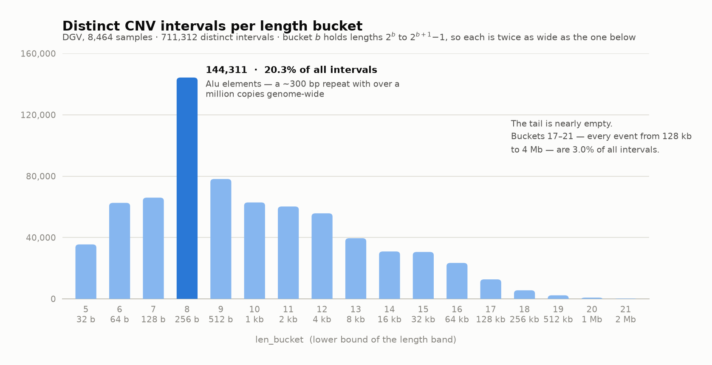
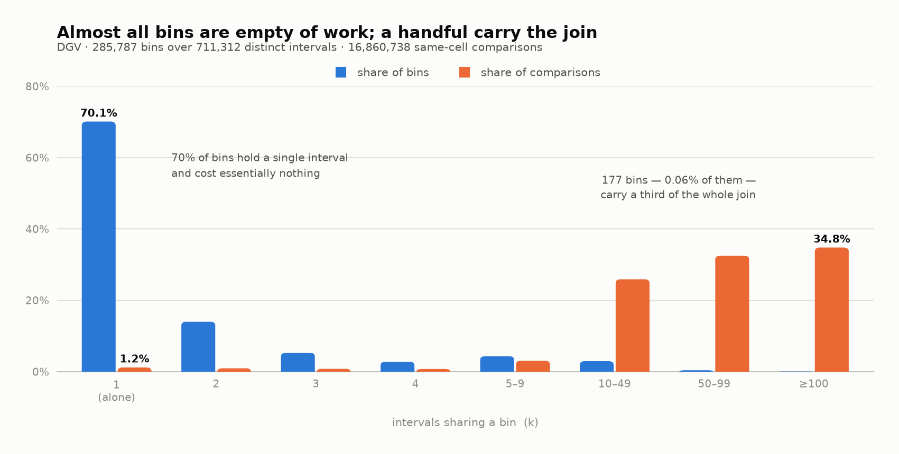

# How CNV cohort frequency works — a developer's guide

**Audience:** developers. No genomics background assumed.
**Companion to:** `SJRA-1786-cnv-cohort-frequencies.md`, which is the design doc. This one explains *why*
the algorithm looks the way it does.

---

## 1. The problem

### 1.1 What we want

For every CNV we store, we want one number: **how many of our patients carry this same CNV?**

That number is a filter. Most of what a caller reports is common in the population, or is a recurring
artifact of the sequencing itself. Neither is interesting for a clinical case. If we know an event is
present in 40% of our cohort, the analyst can hide it and look at the rest.

We already do exactly this for SNVs. It is a `GROUP BY`. Two lines of SQL.

For CNVs it is not. That is the whole story of this document.

### 1.2 What is a CNV

Think of a genome as a very long array of characters — about 3 billion of them, split into 24 chunks
called chromosomes.

An **SNV** (Single Nucleotide Variant) is a single-cell edit:

```
reference : ... A C G T A C G T ...
patient   : ... A C G A A C G T ...
                      ^ position 3,412,556 : T became A
```

A **CNV** (Copy Number Variation) is a *bulk* edit. A whole slice of the array is duplicated or deleted:

```
reference : ... [ 900 kb of sequence ] ...
patient A : ... [                    ] ...   <- the slice is gone      (LOSS)
patient B : ... [ 900 kb ][ 900 kb   ] ...   <- the slice is doubled   (GAIN)
```

So a CNV is not a point. It is an **interval**: `(chromosome, start, end, type)`. Typical sizes run from
a few hundred bases to several megabases.

The `type` matters. `LOSS` and `GAIN` are opposite events. There are others (`CNLOH`, `GAINLOH`), but for
now just treat `type` as an enum that must match exactly.

### 1.3 Why counting is hard

An SNV has an **exact key**. Position 3,412,556, `T` to `A`. Two patients either have it or they do not.
We pack that into a `locus_id` and count with `GROUP BY locus_id`. Per-partition counts even add up,
which is why the SNV pipeline can be incremental.

A CNV has no exact key, because **the coordinates are estimates**.

Nobody reads the patient's genome as one continuous string. The sequencer produces short fragments, and
the CNV caller infers "there is less material here than expected, between roughly X and roughly Y". Where
exactly X and Y land depends on read coverage, on the caller's internal bin size, and on which exon
targets the capture kit happened to include.

The result: two patients with the **same biological deletion** get reported with **different numbers**.

```
patient A : chr1  1,000,000 ---------------------------- 2,000,000   LOSS
patient B : chr1  1,010,000 -------------------------- 1,990,000     LOSS
patient C : chr1  1,004,500 ----------------------------- 2,003,000   LOSS
```

Same event. Three different keys.

We do have a `cnv_id` — a bit-packed `(chromosome, start, length, type)`, the CNV analogue of `locus_id`.
But `cnv_id` equality means *"the same reported interval"*, not *"the same event"*. Grouping on it counts
A, B and C as three separate singletons. That is the wrong answer, and §7.1 of the design doc measures how
wrong: about **4 calls per patient** get labelled "rare, seen once" when they are actually present in 5%
or more of the cohort. Those are precisely the calls that survive filtering and land on an analyst's desk.

So we cannot use equality. We need a rule for **"close enough to be the same event"**.

### 1.4 Reciprocal overlap

The rule the field uses, and the one already in our codebase for the gnomAD-SV join, is **80% reciprocal
overlap**.

Compute the shared region of two intervals:

```
overlap = max(0, min(end_a, end_b) - max(start_a, start_b))
```

Then require it to be big relative to **both** intervals:

```
match  <=>  overlap >= 0.8 * length_a   AND   overlap >= 0.8 * length_b
```

That is it. Two comparisons.

**Why "reciprocal" — i.e. why check both sides?**

Because a one-sided test is trivially fooled by nesting:

```
big   : ------------------------------------------------  1 Mb LOSS
small :                    ---                             5 kb LOSS
```

The small deletion is 100% covered by the big one. A one-sided test says "match". But these are not the
same event at all — one removes a gene, the other removes a whole neighbourhood.

Checking both directions forces the two intervals to be comparable in **size** as well as in **position**.
The `5 kb / 1 Mb` pair fails instantly: the overlap is 5 kb, and 80% of the big one is 800 kb.

**Worked example.** Four intervals, all `LOSS` on chr1:

| id | start | end | length |
|---|---|---|---|
| A | 1,000,000 | 2,000,000 | 1,000 kb |
| B | 1,010,000 | 1,990,000 | 980 kb |
| C | 1,000,000 | 1,400,000 | 400 kb |

- **A vs B** — overlap is 980 kb. 80% of A is 800 kb ✓. 80% of B is 784 kb ✓. **Match.**
- **A vs C** — overlap is 400 kb. 80% of A is 800 kb ✗. **No match.** C is a genuinely smaller event.

Two useful properties fall out of the rule, and part 2 leans on both:

- Matching intervals have lengths within **1.25×** of each other. (If B is more than 25% longer than A,
  the overlap cannot reach 80% of B.) → [why](#a2-why-lengths-must-be-within-125)
- Their start positions are within **20% of a length** of each other — and *which* length matters more than
  it looks. → [why](#a3-why-starts-must-be-within-20-of-a-length)

Both are worth internalising now: *80% reciprocal overlap means "similar size, and nearly the same place"*.
Neither is a heuristic; both are forced by the predicate, and both are proved from one obvious fact in
[Appendix A](#appendix-a-where-the-two-bounds-come-from).

### 1.5 One consequence to know up front

Reciprocal overlap is **not transitive**. `A` matching `B` and `B` matching `C` does **not** imply `A`
matches `C`.

Three deletions all starting at the same point:

| | length | vs D | vs E | vs F |
|---|---|---|---|---|
| **D** | 100 kb | — | ✗ | ✓ |
| **E** | 180 kb | ✗ | — | ✗ |
| **F** | 120 kb | ✓ | ✗ | — |

`F` matches both `D` and `E`. `D` and `E` do not match each other.

For a developer the practical meaning is: **there is no set of "CNV variants" to group by.** You cannot
build the equivalence classes, because the relation is not an equivalence relation. Any attempt to force
intervals into groups has to make an arbitrary call somewhere.

So we do the other thing. For **each** interval, we count the patients carrying anything that matches
**it**. Every interval gets its own answer. Two overlapping intervals may legitimately end up with
slightly different frequencies, and that is correct, not a bug.

That is why this is a **join**, not a `GROUP BY`. And a join of a table against itself, on a predicate
that no index can help with.

---

## 2. The test dataset — DGV

Before writing production SQL we benchmarked on real data at real scale.

**DGV** — the [Database of Genomic Variants](http://dgv.tcag.ca/) — is a public catalogue of structural
variation found in healthy individuals. We used the GRCh38 supporting-variants export
(`GRCh38_hg38_supportingvariants_2025-12-01.txt`).

After cleanup:

| | |
|---|---|
| samples | **8 464** |
| CNV calls | **5 760 822** |
| distinct intervals (`cnv_id`) | **711 312** |
| collapse ratio | **8.1 : 1** |

Two cleanup rules were needed and are worth recording:

- DGV ships both raw per-sample rows and its **own pre-merged rows**. Keeping both double-counts. We kept
  only the per-sample ones.
- DGV includes alternate contigs (scaffolds that are not the 24 main chromosomes). Our `cnv_id` packing
  has 5 bits of chromosome, so they were dropped.

**Why DGV is a good stress test.** It aggregates studies from many technologies and many resolutions.
Different technologies place breakpoints differently, so DGV manufactures the exact thing that makes this
problem hard: lots of near-identical intervals with slightly different coordinates. It is the
**pessimistic** case.

We cross-checked everything against a second, independent dataset — 7 151 samples of real DRAGEN exome
output, one caller, one regime. It collapses about twice as well (15.2 : 1) and is roughly 13× cheaper to
join. The numbers below are the bad case, not the typical one.

**Sanity check that the data is real.** The single most frequent interval in DGV is a ~45 kb deletion at
chr1:72.3 Mb, present in **44%** of samples. That is a well-known common deletion near the *NEGR1* gene.
Finding it is evidence the matching works; we would be worried if the top hit were something nobody has
heard of.

---

## 3. The naive implementation — brute force

Now the obvious version. Two steps.

### 3.1 Step 1 — collapse

Do not join 5.76 million rows. Most of them are duplicates: many patients report byte-identical
intervals. Collapse to distinct intervals first.

```sql
distinct_cnv AS (
    SELECT cnv_id,
           ANY_VALUE(chromosome) AS chromosome,
           ANY_VALUE(`start`)    AS `start`,
           ANY_VALUE(`end`)      AS `end`,
           ANY_VALUE(`type`)     AS `type`
    FROM germline__cnv__occurrence
    GROUP BY cnv_id
)
```

`ANY_VALUE` is safe because `cnv_id` is an injective packing of exactly those four fields. Same `cnv_id`
means same chromosome, same start, same length, same type. That is the point of keying on it.

**5 760 822 rows become 711 312.** An 8.1× reduction before we do any work. Since the join cost is
quadratic, that alone is a **65×** saving.

### 3.2 Step 2 — compare everything against everything

```sql
SELECT a.cnv_id AS query_id,
       b.cnv_id AS match_id
FROM distinct_cnv a
JOIN distinct_cnv b
  ON  a.chromosome = b.chromosome      -- <- the only pruning we have
  AND a.`type`     = b.`type`          -- <-
WHERE GREATEST(0, LEAST(a.`end`, b.`end`) - GREATEST(a.`start`, b.`start`)) >= 0.8 * (a.`end` - a.`start`)
  AND GREATEST(0, LEAST(a.`end`, b.`end`) - GREATEST(a.`start`, b.`start`)) >= 0.8 * (b.`end` - b.`start`)
```

This is correct. It is the definition, transcribed.

Note what the two `ON` clauses do and do not do. They are **equality** predicates, so the engine can hash
on them — they are real join keys and they cost nothing. A deletion on chr1 is never compared to a
deletion on chr7, and a `LOSS` is never compared to a `GAIN`.

But the `WHERE` clause is not a join key. There is no way to hash `GREATEST(0, LEAST(...) - GREATEST(...))`.
So within each `(chromosome, type)` bucket, the engine has to compare **every interval against every other
interval** and evaluate the arithmetic. That is a nested loop.

### 3.3 What it costs

Measured on StarRocks 4.0.13, single node on minikube:

| | |
|---|---|
| distinct intervals | 711 312 |
| pairs if we joined with no `ON` clause at all | **505 964 761 344** (~506 billion) |
| pairs actually compared, after `chromosome` + `type` | **~19 500 000 000** (19.5 billion) |
| pairs that pass the 80% test | **15 199 004** |
| runtime | **152 s** |
| outcome | correct result — then the compute node was OOMKilled |

Read that table slowly, because every line is a lesson.

**Chromosome + type is worth 26×.** 506 billion down to 19.5 billion. That is the cheapest pruning
available and it is basically free — two equality predicates. It is also nowhere near enough.

**The hit rate is 0.078%.** Of 19.5 billion comparisons, 15.2 million produce a match. **We do about
1 283 units of work per useful result.** Almost the entire runtime is spent proving that two intervals
which are far apart are, indeed, far apart. That is the inefficiency part 2 attacks.

**152 seconds is not "fine".** Three reasons:

1. It is quadratic. Distinct intervals grew 5× as we scaled the cohort from 12% to 100% — so brute-force
   cost grew **25×**. At 50 000 samples this approach is dead, not slow.
2. It OOMKilled the node. The intermediate is enormous and the engine has to spill or die.
3. It buys nothing. The binned version in part 2 returns **the exact same 15 199 004 pairs in 486 ms** —
   a **313×** speedup, with a proof that it cannot miss anything.

**Why the chromosome/type pruning does not save us.** It divides the work by the number of
`(chromosome, type)` combinations — roughly 24 × 4. But the division is uneven and, more importantly, it
is a *constant* factor. The problem is still O(n²) inside each bucket. Constant factors do not fix
quadratic growth.

What we actually need is pruning that is proportional to the data: a key that puts an interval near the
intervals it could plausibly match, and far from the ones it cannot. Something we can put in the `ON`
clause as an `=`.

The rule already gives us the raw material. From §1.4: a match must be
[**within 1.25× in length**](#a2-why-lengths-must-be-within-125) and
[**within 20% of a length in position**](#a3-why-starts-must-be-within-20-of-a-length). Both of those are
statements about closeness, and closeness can be bucketed.

That is part 2.

---

## 4. Binning — the idea

### 4.1 What we are actually trying to buy

Look again at where the brute force spends its time. Every pair inside a `(chromosome, type)` bucket gets
the arithmetic evaluated, and 99.92% of those evaluations return "no". We are paying to discover, 19.5
billion times, that two intervals are nowhere near each other.

The fix is the one you would reach for in any language: **stop scanning, start looking things up.**

But there is a constraint. A database can only build a hash table on **equality**. `a.x = b.x` is a join
key. `a.x BETWEEN b.x - 1 AND b.x + 1` is not — the engine cannot hash a range, so it falls back to
comparing everything, which is what we are trying to escape.

So the goal is precise:

> Find an integer column, computable from a **single** interval, such that two intervals can only match
> if their values are **equal** — or at least, within a small, fixed, known set of values.

That is binning. Give every interval a bucket number. Only compare intervals in the same bucket. If the
bucket assignment is derived from the matching rule itself, the pruning is **lossless** — it cannot drop a
pair that would have matched.

### 4.2 Why length is the natural first candidate

Recall the two properties that fall out of 80% reciprocal overlap (§1.4), both proved in
[Appendix A](#appendix-a-where-the-two-bounds-come-from):

1. Matching intervals have lengths within **1.25×** of each other.
   → [§A.2](#a2-why-lengths-must-be-within-125)
2. Matching intervals start within **20% of a length** of each other.
   → [§A.3](#a3-why-starts-must-be-within-20-of-a-length)

Property 1 is the better starting point, for three reasons.

**It is a property of one interval at a time.** Length is `end - start`. No pair needed, no neighbours,
no context. We can compute it in the `SELECT` that collapses to distinct intervals, at zero cost, and
store it as a plain integer column. Position is a relative constraint — "near *what*?" — and needs more
thought.

**It is a hard, symmetric constraint.** The 1.25× band is not a heuristic or a tuning parameter. It is
forced by the predicate. If `b` is more than 25% longer than `a`, the overlap cannot possibly cover 80% of
`b`, no matter where the two sit — [§A.2](#a2-why-lengths-must-be-within-125) walks through why no
repositioning can rescue it. There is no configuration in which a 300 bp deletion and a 900 bp deletion
are the same event.

**There is a lot of discrimination available.** CNV lengths span five orders of magnitude — our data runs
from 44 bp to 4.1 Mb. Compare that to `type`, which has four values. A column with a huge range is a
column that can cut a dataset into many pieces.

So: bucket the intervals by length, and only compare intervals in the same length bucket.

### 4.3 The trap — fixed-width bins do not work

The obvious implementation is `FLOOR(length / W)` for some width `W`. It fails, and understanding why is
the whole trick.

The constraint is a **ratio**, not a difference. Its absolute size depends entirely on how big the
interval is:

| interval length | partners can be | tolerance |
|---|---|---|
| 300 bp | 240 – 375 bp | ±~75 bp |
| 30 kb | 24 – 37.5 kb | ±~7 500 bp |
| 4 Mb | 3.2 – 5 Mb | ±~1 000 000 bp |

The tolerance grows with the interval. It spans a factor of about 13 000 across our data. No single `W`
can serve both ends:

- **`W = 100 bp`** works for the small events. But a 4 Mb interval now has to probe roughly 10 000
  neighbouring bins to cover its legitimate partners. That is worse than not binning.
- **`W = 1 Mb`** works for the huge events. But **99.85%** of our 711 312 intervals are under 1 Mb, so
  they all land in bin 0. We have achieved nothing.

The bins need to get **wider as the intervals get longer**, at the same rate the tolerance does. A
constraint that is multiplicative needs a scale that is multiplicative.

### 4.4 The fix — bucket on the logarithm

```sql
len_bucket = FLOOR(LOG2(`end` - `start`))
```

That is the entire key. Two functions, both built in.

**Plainly, for anyone who has not looked at `LOG2` since school.** `LOG2(x)` answers *"2 to what power
gives me x?"* — `LOG2(8)` is 3, `LOG2(1024)` is 10. For anything that is not a power of two you get a
decimal: `LOG2(1000)` is 9.966. `FLOOR` throws the decimal away.

Put together, **`FLOOR(LOG2(x))` is the position of the highest set bit** — the exponent of the largest
power of 2 that fits inside `x`. `1000` is `1111101000` in binary: highest bit at position 9, so the
answer is 9. If you prefer it as a bit operation, it is `63 - clz(x)` on a 64-bit integer.

The effect is that bucket `b` holds every length from `2^b` up to `2^(b+1) - 1`. **Each bucket is twice as
wide as the one below it.** That is exactly the property the fixed-width version could not deliver.

### 4.5 What the buckets look like on real data

This is the actual distribution of our 711 312 DGV intervals. It is worth a proper look, because the shape
explains most of what happens later.

<picture>
  <source media="(prefers-color-scheme: dark)" srcset="img/sjra-1786-len-bucket-distribution-dark.png">
  
</picture>

<details>
<summary>Exact values</summary>

| `len_bucket` | min len | max len | intervals | share |
|---|---|---|---|---|
| 0 | 1 | 1 | 1 | 0.00% |
| 1 | 2 | 2 | 1 | 0.00% |
| 4 | 28 | 30 | 3 | 0.00% |
| 5 | 44 | 63 | 35 484 | 4.99% |
| 6 | 64 | 127 | 62 575 | 8.80% |
| 7 | 128 | 255 | 65 984 | 9.28% |
| **8** | **256** | **511** | **144 311** | **20.29%** |
| 9 | 512 | 1 023 | 78 145 | 10.99% |
| 10 | 1 024 | 2 047 | 62 850 | 8.84% |
| 11 | 2 048 | 4 095 | 60 221 | 8.47% |
| 12 | 4 096 | 8 191 | 55 756 | 7.84% |
| 13 | 8 192 | 16 382 | 39 530 | 5.56% |
| 14 | 16 384 | 32 767 | 30 890 | 4.34% |
| 15 | 32 768 | 65 532 | 30 560 | 4.30% |
| 16 | 65 536 | 131 064 | 23 415 | 3.29% |
| 17 | 131 072 | 262 143 | 12 691 | 1.78% |
| 18 | 262 182 | 524 256 | 5 567 | 0.78% |
| 19 | 524 384 | 1 046 884 | 2 289 | 0.32% |
| 20 | 1 049 000 | 2 096 298 | 797 | 0.11% |
| 21 | 2 098 992 | 4 123 510 | 242 | 0.03% |

</details>

**First, the sanity check.** `min_len` and `max_len` land exactly on `2^b` and `2^(b+1) - 1` in every row.
Bucket 10 runs 1 024 – 2 047, bucket 16 runs 65 536 – 131 064. The formula does what it says.

**The distribution is not uniform, and that matters.** We chose length partly because it spans five orders
of magnitude. But the intervals are not spread across that range — they pile up at the bottom. Buckets 5
to 9 hold **54%** of everything, inside a 20-fold length window. Buckets 17 to 21 — every event from
128 kb to 4 Mb, which is most of what a clinician would call a large CNV — hold **3.0%** between them.

**The peak is biology, not noise.** Bucket 8 is 256 – 511 bp, and it holds a fifth of the entire dataset.
That band is dominated by **Alu elements** — a ~300 bp sequence repeated over a million times across the
human genome. Whether a given Alu copy is present varies between people, so they generate an enormous
number of small, near-identical CNVs. Nothing is wrong with the data; the genome really is shaped like
this.

**The stragglers are a warning.** Buckets 0, 1 and 4 hold five rows in total, and buckets 2 and 3 are
empty. Those are DGV artifacts of 1 to 30 bp. They are harmless here, but note what a **zero-length**
interval would do: `LOG2(0)` is undefined, and you get a `NULL` or `-Infinity` bucket that silently drops
the row from every join. Guard the collapse with `WHERE end > start`. Any real dataset has a few of these.

### 4.6 One bucket is not enough — probe ±1

Bucketing alone is not correct yet. Two intervals that genuinely match can land in **different** buckets,
simply because a bucket boundary happened to fall between them.

**Counterexample.** Two deletions at the same start position, lengths 1 000 and 1 100:

- They match: overlap is 1 000, which is ≥ 80% of 1 000 ✓ and ≥ 80% of 1 100 ✓.
- But `1000 < 1024` so it is bucket **9**, and `1100 ≥ 1024` so it is bucket **10**.

A strict `a.len_bucket = b.len_bucket` join would silently drop that pair. So each interval must look in
its own bucket **and both neighbours**.

**Why ±1 is enough.** Matching lengths differ by at most 1.25×
([§A.2](#a2-why-lengths-must-be-within-125)). Since `LOG2(1.25) = 0.32`, the two logarithms differ by less
than 1. Two numbers that differ by less than 1 have floors that differ by at most 1. Therefore
neighbouring buckets always suffice, and a third bucket away is impossible.

Note this argument only needs the length ratio to stay under 2 — so `len_bucket ±1` stays valid for any
overlap threshold down to 0.5. It is not tied to our 80%; see
[§A.6](#a6-if-the-threshold-changes). (The position key in part 3 is much less forgiving.)

### 4.7 The implementation

Do **not** write `BETWEEN a.len_bucket - 1 AND a.len_bucket + 1`. That is a range again, and it puts us
straight back into a nested loop.

Instead, **explode the probe side**: emit three rows per interval, one per offset, so that every join
condition stays an `=`.

```sql
probe AS (
    SELECT d.cnv_id, d.chromosome, d.`type`, d.`start`, d.`end`,
           d.len_bucket + b.db AS t_len_bucket          -- the bucket we are looking IN
    FROM distinct_cnv d
    CROSS JOIN (SELECT -1 AS db UNION ALL SELECT 0 AS db UNION ALL SELECT 1 AS db) b
)
SELECT p.cnv_id AS query_id, t.cnv_id AS match_id
FROM probe p
JOIN distinct_cnv t
  ON  t.chromosome = p.chromosome
  AND t.`type`     = p.`type`
  AND t.len_bucket = p.t_len_bucket        -- <- equality. hashable.
WHERE GREATEST(0, LEAST(p.`end`, t.`end`) - GREATEST(p.`start`, t.`start`)) >= 0.8 * (p.`end` - p.`start`)
  AND GREATEST(0, LEAST(p.`end`, t.`end`) - GREATEST(p.`start`, t.`start`)) >= 0.8 * (t.`end` - t.`start`);
```

### 4.8 What `probe` actually contains

The `CROSS JOIN` is the part people squint at, so here it is on four rows. All on chr1:

**`distinct_cnv` — the input**

| `cnv_id` | `type` | `start` | `end` | length | `len_bucket` |
|---|---|---|---|---|---|
| A | LOSS | 1 000 | 2 000 | 1 000 | 9 |
| B | LOSS | 1 000 | 2 100 | 1 100 | **10** |
| C | LOSS | 1 000 | 1 400 | 400 | 8 |
| D | GAIN | 1 000 | 2 000 | 1 000 | 9 |

A and B are the straddling pair from §4.6 — they genuinely match, but a bucket boundary at 1 024 splits
them. C is a real non-match. D is A's coordinates with the wrong `type`.

**`probe` — three rows per interval**

Each interval keeps its own coordinates and gains a `t_len_bucket`: **the bucket it is going to go looking
in.** Twelve rows out of four.

| `cnv_id` | `start` | `end` | `len_bucket` | `db` | `t_len_bucket` |
|---|---|---|---|---|---|
| A | 1 000 | 2 000 | 9 | −1 | 8 |
| A | 1 000 | 2 000 | 9 | 0 | 9 |
| A | 1 000 | 2 000 | 9 | +1 | **10** |
| B | 1 000 | 2 100 | 10 | −1 | **9** |
| B | 1 000 | 2 100 | 10 | 0 | 10 |
| B | 1 000 | 2 100 | 10 | +1 | 11 |
| C | 1 000 | 1 400 | 8 | −1 | 7 |
| C | 1 000 | 1 400 | 8 | 0 | 8 |
| C | 1 000 | 1 400 | 8 | +1 | 9 |
| D | 1 000 | 2 000 | 9 | −1 | 8 |
| D | 1 000 | 2 000 | 9 | 0 | 9 |
| D | 1 000 | 2 000 | 9 | +1 | 10 |

The row in bold is the one that saves us: A's `db = +1` row goes hunting in bucket 10, which is where B
lives. Without it, A and B never meet.

**The join — what each probe row finds**

| probe row | looks in | finds | overlap test | result |
|---|---|---|---|---|
| A, `db=−1` | LOSS/8 | C | 400 < 0.8×1 000 | rejected |
| A, `db=0` | LOSS/9 | A | self | **match** |
| A, `db=+1` | LOSS/10 | B | 1 000 ≥ 800 and ≥ 880 | **match** |
| B, `db=−1` | LOSS/9 | A | 1 000 ≥ 880 and ≥ 800 | **match** |
| B, `db=0` | LOSS/10 | B | self | **match** |
| B, `db=+1` | LOSS/11 | — | — | nothing there |
| C, `db=−1` | LOSS/7 | — | — | nothing there |
| C, `db=0` | LOSS/8 | C | self | **match** |
| C, `db=+1` | LOSS/9 | A | 400 < 0.8×1 000 | rejected |
| D, `db=−1` | GAIN/8 | — | — | C is LOSS |
| D, `db=0` | GAIN/9 | D | self | **match** |
| D, `db=+1` | GAIN/10 | — | — | B is LOSS |

Four things to take from that table:

- **8 candidate pairs were evaluated, 6 survived.** The other 8 of the 16 possible pairs were never
  looked at.
- **A↔B is found from both sides**, once as `A→B` and once as `B→A`. That is intentional — the output is
  *ordered* pairs, because in the next step every interval needs its own carrier count.
- **No pair is found twice from the same side.** A's three probe rows target buckets 8, 9 and 10 — all
  distinct — so `A→B` can only ever come from the `db=+1` row. This is why the final query needs no
  `DISTINCT`.
- **B and C are never compared.** Their buckets are 10 and 8, two apart. That is the pruning working, and
  it is safe: a 400 bp interval cannot be 80%-reciprocal with an 1 100 bp one, whatever their positions
  ([§A.2](#a2-why-lengths-must-be-within-125) — 1 100 is more than 1.25 × 400).

Do not read the 16 → 8 saving as the payoff. On four rows the pruning is nearly invisible, and the probe
explosion has tripled the left-hand side to pay for it. The win is quadratic, so it only appears at scale —
which is the next section.

The table is now 3× taller on the probe side, and that is a bargain — three hash lookups beat a scan of
14 819 rows.

The overlap test has not gone anywhere. It stays in the `WHERE` as a **residual filter**: the join finds
*candidates*, the predicate confirms *matches*. The binning never decides correctness, only what gets
looked at. That separation is what makes the optimisation safe to reason about.

### 4.9 What it actually bought — measured

Same machine, same data, same query shape as §3.3:

| | brute force | **+ `len_bucket` ±1** |
|---|---|---|
| join groups | 48 | **791** |
| average group size | 14 819 | **899** |
| largest group | 46 240 | **11 320** |
| comparisons | 19 510 218 868 | **6 017 921 708** |
| runtime | 152 s | **40.8 s** |
| pairs found | 15 199 004 | **15 199 004** |

**The result is identical.** Not "close" — the same 15 199 004 pairs. That is the lossless property doing
its job, and it is the first thing to check when adding any bin key.

Runtime fell 3.7×, comparisons fell 3.2×. Those two numbers tracking each other is worth noticing: it
confirms that **runtime is essentially proportional to the comparison count**, so we can predict the cost
of a binning scheme by counting comparisons instead of running it. Everything from here uses that.

### 4.10 Why only 3.7× — and why we keep it anyway

A 3.7× speedup is real, but it is not the 300× we need. Two reasons, both visible in the tables above.

**Lengths are concentrated — and cost is quadratic.** We hoped five orders of magnitude would cut the data
finely. It does not, because the intervals pile up at the small end (§4.5). Worse, a bucket's share of the
*work* is not its share of the *rows*: doubling a group's size quadruples its cost. Measured per bucket:

| `len_bucket` | share of rows | share of comparisons |
|---|---|---|
| 5 | 4.99% | 2.62% |
| 6 | 8.80% | 7.77% |
| 7 | 9.28% | 9.08% |
| **8** | **20.29%** | **45.15%** |
| 9 | 10.99% | 11.74% |
| 10 | 8.84% | 6.61% |
| 11 | 8.47% | 6.07% |
| 12 | 7.84% | 5.05% |
| 13 – 21 | 20.51% | 5.91% |

**Bucket 8 is a fifth of the data and nearly half the bill.** Every large event in the genome — buckets 13
through 21, a fifth of all intervals — costs less than 6% combined. Splitting 48 groups into 791 sounds
like a 16× win, but you pay for the big groups, and the big groups stayed big.

**The ±1 probe gives most of it back.** Comparing only within the same bucket would cost 2.25 billion.
The ±1 probe brings that to 6.02 billion — a **2.7× tax** on the pruning we just won. Correctness is not
free.

The hit rate improved from 0.078% to 0.25%. Better — about 396 comparisons per useful result instead of
1 283 — but still a spectacular amount of wasted work.

So why keep `len_bucket` at all?

Because **it was never going to be sufficient on its own, and it is not meant to be.** Look at what it
does and does not constrain. Length binning says "these two events are the same size". It says nothing
whatsoever about *where they are*. A 300 bp deletion at the start of chr1 and a 300 bp deletion at the end
of chr1 sit in the same bucket and get compared, every time. On a 250 Mb chromosome, that is almost all of
the remaining work.

Position is where the discrimination lives. It is also the harder key, because "near" is relative and the
tolerance changes with the interval — the same problem `len_bucket` just solved, one level deeper.

And here is the payoff for having done length first: **the length bucket is what tells us how wide the
position bins should be.** The two keys are not independent additions. The second is built on the first.

---

## 5. The position key

### 5.1 What length binning left on the table

After §4 we compare intervals only when they are on the same chromosome, the same `type`, and roughly the
same size. What we still do not use at all is **where they are**.

The largest surviving group is **11 320 intervals** — one chromosome, one type, one length bucket. Every
one of those is compared against every other, which is 128 million comparisons in that single group. They
are all about the same length. They are scattered across a couple of hundred megabases.

Almost all of that work is comparing a deletion near the start of a chromosome with a deletion near the
end. We already know they cannot match. We are just not telling the database.

So: bin on position.

### 5.2 The same trap, one level deeper

The obvious move is a fixed grid. Chop each chromosome into 10 kb cells, bin on the cell number, compare
only within a cell.

It fails for exactly the reason fixed-width *length* bins failed in §4.3 — the tolerance is not a fixed
number of bases. From [§A.5](#a5-putting-them-together-the-search-radius), a partner's start can be up to
**25% of the query's length** away:

| interval length | how far a partner's start can be |
|---|---|
| 300 bp | 75 bp |
| 30 kb | 7 500 bp |
| 4 Mb | 1 000 000 bp |

Same spread as before, and the same squeeze:

- **A 1 kb grid** suits the small events. But a 4 Mb interval tolerates a megabase of drift, so it would
  have to probe **1 000 cells** to find its partners.
- **A 1 Mb grid** suits the big ones. But then every event under 1 Mb — **99.85%** of the dataset — falls
  into a cell holding everything else nearby, and small intervals get essentially no pruning.

The cells have to be **narrow for short intervals and wide for long ones**.

### 5.3 The fix — we already computed the width

We already sorted every interval into a length bucket. Bucket `b` holds lengths from `2^b` to
`2^(b+1) − 1`. So use **`2^b` as the grid width** — each interval gets binned on a grid whose cells are
about as wide as the interval itself.

```sql
pos_bin = FLOOR(`start` / POW(2, len_bucket))
```

Every interval is binned at **its own resolution**:

| interval | length | `len_bucket` | grid width | `start` | `pos_bin` |
|---|---|---|---|---|---|
| a 300 bp deletion | 300 | 8 | 256 | 1 000 000 | 3 906 |
| a 30 kb deletion | 30 000 | 14 | 16 384 | 1 000 000 | 61 |
| a 3 Mb deletion | 3 000 000 | 21 | 2 097 152 | 1 000 000 | 0 |

Three intervals at the same start position, three completely different cell numbers. That is the point, and
it is also the thing that bites in §5.4.

> **The words, pinned down.** Four terms get used from here on, and they are not interchangeable.
>
> | term | what it is |
> |---|---|
> | **bucket** | a *length* class. `len_bucket` `b` holds every interval of length `2^b` … `2^(b+1) − 1`. |
> | **grid** | a whole chromosome chopped into equal-width pieces. **One grid per bucket**, of width `2^b`. It is a ruler, not stored anywhere. |
> | **cell** | **one piece of one grid.** `pos_bin` is the cell's number. |
> | **bin** | one cell, on one chromosome, for one `type` — i.e. one complete join key. This is what the engine hashes, and what §5.12 counts. |
>
> So a **grid is not a cell** — a grid is the whole ruler, a cell is one mark-to-mark segment of it. On the
> 1 024-wide grid, cell 3 covers positions 3 072 – 4 095, and an interval starting at 4 090 is in cell 3.
>
> The consequence worth carrying forward: **there are as many grids as there are length buckets** — 17 of
> them in our data — and each interval is measured against the grid belonging to *its own* bucket. Two
> intervals in different buckets are measured on different rulers, which is why §5.4 exists.

**As a bit operation.** Dividing by `2^len_bucket` and flooring is just a right shift — `start >> len_bucket`.
So the key is "**take `start` and throw away the low `len_bucket` bits**". Both of our keys are bit
operations on the interval: `len_bucket` is the position of the highest set bit of the *length*, and
`pos_bin` is the *start* with that many low bits discarded.

### 5.4 The subtlety that breaks naive implementations

Here is the part that looks fine and is not.

A cell number only means something **relative to its own grid**. Cell 61 on the 16 kb grid and cell 61 on
the 256 bp grid describe completely different places on the chromosome. So when a query in bucket 15 goes
looking in bucket 14, **it cannot reuse its own `pos_bin`.**

Concretely. An interval starting at 1 000 000, in bucket 15 (grid width 32 768):

```
its own cell       : 1 000 000 / 32 768  = 30.5  -> cell 30
```

Now it wants to probe bucket 14, whose grid width is 16 384:

```
where it lands     : 1 000 000 / 16 384  = 61.0  -> cell 61
what "30 +/- 1" is : cells 29, 30, 31
```

**61 is nowhere near 29–31.** Probing its own cell number against a neighbouring bucket looks up a location
half a chromosome away. Every cross-bucket match is lost.

So the probe recomputes the bin **for each target bucket it visits**, using that bucket's width:

```sql
FLOOR(d.`start` / POW(2, d.len_bucket + b.db))   -- b.db is the target bucket offset
```

The mental model: *for each candidate length bucket, work out where I would land on **its** grid, then
look in that cell and its two neighbours.*

This is not a theoretical worry. Getting it wrong is the single most expensive mistake available here, and
§5.9 has it measured: the version that ranges over stored `pos_bin` values found **582 of 861 196**
cross-bucket pairs. It returns a plausible number, 5.7% short, with no error.

### 5.5 Why ±1 is enough

Same shape of argument as §4.6, but now the tolerance and the grid both scale, so it needs a moment.

Take a query in bucket 10. Its length is somewhere in 1 024 – 2 047, so at worst 2 047. From
[§A.5](#a5-putting-them-together-the-search-radius) a partner's start is within 25% of that:

```
max drift  =  0.25 x 2 047  =  511.75,  call it 512 bases
```

**"Drift" means the gap between the two *start positions*** — how far apart the query and a candidate
partner begin. Not their lengths, not their ends. Just the two starts.

Two things about that 512 before we use it:

- It is a property of the **query alone**. It comes from the query's length, so it is the same 512
  whichever bucket we go looking in.
- It works in **both directions**. A partner may start up to 512 before the query or 512 after it. That is
  why the probe is `±1` and not just `+1`.

**Now, why convert it into cells.** The question we actually need answered is not "how many bases apart can
they be" — it is **"how many cell boundaries can fall between them"**. That is what decides whether
stepping one cell either way reaches far enough.

A boundary count depends on how wide the cells are, so we divide:

```
drift as a fraction of one cell  =  max drift  ÷  cell width of the grid being searched
```

The same 512 bases is a *quarter* of a 2 048-wide cell, *half* of a 1 024-wide cell, and a *whole*
512-wide cell. One distance, three different answers, because the ruler changes:

| target bucket | cell width | max drift | ...as a fraction of one cell |
|---|---|---|---|
| 11 | 2 048 | 512 | `512 / 2 048` = **0.25** |
| 10 | 1 024 | 512 | `512 / 1 024` = **0.50** |
| **9** | **512** | **512** | `512 / 512` = **1.00** ← the tight one |

**Why "under one cell wide" is exactly the right thing to check.** To land *two* cells away from the query,
a partner has to clear an entire cell on the way — and clearing a whole cell costs a full cell width. So a
drift shorter than one cell simply cannot reach two cells.

Concretely, on the 512-wide grid:

```
   cell 0        cell 1        cell 2        cell 3
|-----------|-------------|-------------|-------------|
0          512          1024          1536          2047

query starts at 600            -> cell 1
partner may start up to 1112   -> cell 2   (600 + 512)
to reach cell 3 it would need  >= 1536     — that is 936 away, nearly twice the budget
```

The partner lands in cell 1 or cell 2. Its own cell, or next door. Never further. And by symmetry, never
further than one cell to the left either.

That is the entire argument:

> **drift < one cell width  ⟹  cell numbers differ by at most 1  ⟹  `pos_bin ±1` is enough.**

And the table shows the drift stays under one cell width for **all three** buckets the probe visits, so the
rule holds everywhere.

**The bottom row has no margin.** Look at it again: the drift is 512 and the cell is 512 wide. It only just
fits — and it fits at all because the query length is strictly *under* 2 048, making the real drift 511.75
rather than 512. Widen the tolerance by even a little and a partner could reach two cells away, unseen.
That is what §5.11 is about.

### 5.6 The nine keys

Three length offsets × three position offsets = **nine cells** to probe per interval. Every join condition
is still an `=`.

```sql
probe AS (
    SELECT
        d.cnv_id, d.chromosome, d.`type`, d.`start`, d.`end`,
        d.len_bucket + b.db                                    AS t_len_bucket,
        FLOOR(d.`start` / POW(2, d.len_bucket + b.db)) + p.dp   AS t_pos_bin
    FROM distinct_cnv d
    CROSS JOIN (SELECT -1 AS db UNION ALL SELECT 0 AS db UNION ALL SELECT 1 AS db) b
    CROSS JOIN (SELECT -1 AS dp UNION ALL SELECT 0 AS dp UNION ALL SELECT 1 AS dp) p
),
matches AS (
    SELECT p.cnv_id AS query_id, t.cnv_id AS match_id
    FROM probe p
    JOIN distinct_cnv t
      ON  t.chromosome  = p.chromosome
      AND t.`type`      = p.`type`
      AND t.len_bucket  = p.t_len_bucket
      AND t.pos_bin     = p.t_pos_bin
    WHERE GREATEST(0, LEAST(p.`end`, t.`end`) - GREATEST(p.`start`, t.`start`)) >= 0.8 * (p.`end` - p.`start`)
      AND GREATEST(0, LEAST(p.`end`, t.`end`) - GREATEST(p.`start`, t.`start`)) >= 0.8 * (t.`end` - t.`start`)
)
```

**Reading `t_pos_bin` piece by piece.** That one expression does three separate jobs, and they are easy to
run together:

```sql
FLOOR(d.`start` / POW(2, d.len_bucket + b.db)) + p.dp
        \________________________________/      \___/
                       (2)                       (3)
                  \_________________/
                          (1)
```

| | piece | what it decides |
|---|---|---|
| **(1)** | `d.len_bucket + b.db` | **which grid** to search — the target length bucket, and therefore the cell width |
| **(2)** | `FLOOR(start / that width)` | **which cell** the query itself lands in, on that grid |
| **(3)** | `+ p.dp` | **step to that cell's neighbours** — one left, itself, one right |

Steps (1) and (2) are §5.4. Step (3) is the part that is easy to skip over, so here it is on its own.

**Why the neighbours are needed.** Landing in a cell is not the same as your partner landing in it. The
query can sit right up against a cell edge, and a partner a few bases away falls on the other side of the
line.

Take a query starting at **4 090**, length 1 200 — so `len_bucket` 10, and a grid 1 024 wide:

```
   cell 2              cell 3                cell 4
|--------------|--------------------|--------------------|
2048           3072                 4096                 5120
                                   ^
                                   query starts at 4 090
                                   — just 6 bases short of the cell 3 / cell 4 edge

                    partners may start anywhere up to 4 390  ->  that is cell 4
```

The query lands in **cell 3** (`4 090 / 1 024 = 3.99`). Its search radius is `0.25 × 1 200 = 300`, so a
partner can start anywhere up to 4 390 — which is **cell 4**. Look only in cell 3 and every one of those
partners is invisible.

The mirror case is a query just *after* an edge, whose partners trail back into the previous cell. Hence
`−1` as well as `+1`.

This is the same problem as §4.6, on the other axis: **a grid boundary is an arbitrary line, and it does
not care whether the two intervals match.** There, lengths 1 000 and 1 100 straddled the 1 024 boundary.
Here it is start positions straddling a cell edge.

**Why exactly one cell either way, and no more.** §5.5 is the answer: the drift is always less than one
cell of whatever grid is being searched, so a partner can only ever be in the cell next door. Two cells
away is impossible. That is why `p.dp` runs over `−1, 0, +1` and stops.

**One ordering trap.** The `+ p.dp` comes *after* the division, on purpose. It steps by **whole cells of
the target grid**. Writing `FLOOR((d.start + p.dp) / …)` instead would shift the start by a single **base**
before binning — almost always landing back in the same cell, and achieving nothing.

**The nine cells are all distinct**, so a given ordered pair can be found at most once. No `DISTINCT` is
needed anywhere downstream. (Same argument as §4.8, now in two dimensions.)

### 5.7 The probe, on one interval

§4.8 walked the three-row probe. Here is the nine-row version, on the query from §5.6.

**The query `P`** — chr1, LOSS, start **4 090**, end **5 290**, so length **1 200** and `len_bucket` **10**.

**Step 1 — where does `P` land on each of the three grids it will visit?**

| target bucket | grid width | `4 090 ÷ width` | cell |
|---|---|---|---|
| 9 | 512 | 7.99 | **7** |
| 10 | 1 024 | 3.99 | **3** |
| 11 | 2 048 | 1.99 | **1** |

**Cells 7, 3 and 1 — one interval, three different cell numbers.** That is §5.4 in a single table. Reusing
`P`'s own cell (3) when searching bucket 9 would look up cell 3 of the 512-wide grid, which is around
position 1 536 — nowhere near `P`.

**Step 2 — the nine probe rows.** Each base cell, plus its two neighbours:

| `db` | `dp` | `t_len_bucket` | `t_pos_bin` |
|---|---|---|---|
| −1 | −1 | 9 | 6 |
| −1 | 0 | 9 | 7 |
| −1 | +1 | 9 | **8** |
| 0 | −1 | 10 | 2 |
| 0 | 0 | 10 | **3** |
| 0 | +1 | 10 | **4** |
| +1 | −1 | 11 | 0 |
| +1 | 0 | 11 | 1 |
| +1 | +1 | 11 | 2 |

Nine `(t_len_bucket, t_pos_bin)` pairs, all distinct. Every one is an exact-equality lookup.

**Step 3 — what is in the table.** Four other chr1 LOSS intervals, each with its own keys:

| id | start | end | length | `len_bucket` | `pos_bin` |
|---|---|---|---|---|---|
| `P` | 4 090 | 5 290 | 1 200 | 10 | 3 |
| `T1` | 4 200 | 5 400 | 1 200 | 10 | 4 |
| `T2` | 4 300 | 5 300 | 1 000 | **9** | 8 |
| `T3` | 9 000 | 10 200 | 1 200 | 10 | 8 |
| `T4` | 4 090 | 5 690 | 1 600 | 10 | 3 |

**Step 4 — what the nine lookups find:**

| probe cell | finds | shared region | vs 80% of `P` (960) | vs 80% of target | result |
|---|---|---|---|---|---|
| (10, 3) | `P` | — | — | — | **self** |
| (10, 3) | `T4` | 1 200 | ✓ | 1 280 ✗ | rejected |
| (10, 4) | `T1` | 1 090 | ✓ | 960 ✓ | **match** |
| (9, 8) | `T2` | 990 | ✓ | 800 ✓ | **match** |
| other six | — | — | — | — | empty |

`T3` never appears. It sits in cell 8 of the bucket-10 grid, and `P` only probes cells 2, 3 and 4 there.

Four things this shows that the length-only probe could not:

- **`T1` was found by a neighbour cell.** It is only 110 bases along from `P` — obviously the same event —
  but that was enough to push it over a cell edge into cell 4. Without `dp = +1` it is invisible. This is
  the §5.6 diagram, with numbers.
- **`T2` was found across buckets, at the recomputed bin.** It is shorter (1 000), so it lives in bucket 9,
  and it was found at cell **8** — a number that appears nowhere in `P`'s own row. Only the recomputation
  in step 1 makes that lookup land in the right place.
- **`T3` was pruned by position, and this is the new saving.** Length binning alone would have compared it:
  same chromosome, same type, same `len_bucket` 10. The position key is what removes it, and §5.1's 11 320
  -interval group is full of `T3`s.
- **`T4` was compared and rejected.** Same cell, same bucket, but 1 600 against 1 200 is a ratio of 1.33 —
  outside the 1.25 band from [§A.2](#a2-why-lengths-must-be-within-125). The bins put it in front of the
  predicate; the predicate threw it out. **Binning never decides correctness**, it only decides what gets
  looked at.

### 5.8 What it cost — the whole ladder

Every row below returns **the same 15 199 004 pairs**. Only the amount of work changes.

| pruning | groups | comparisons | hit rate | time |
|---|---|---|---|---|
| `chromosome` + `type` | 48 | 19 510 218 868 | 0.078% | 152 s |
| + `len_bucket` ±1 | 791 | 6 017 921 708 | 0.25% | 40.8 s |
| **+ `pos_bin` ±1 (nine cells)** | **285 787** | **32 006 039** | **47.5%** | **0.48 s** |

**The position key is where the win actually was.** It cut comparisons another **188×** and runtime **85×**,
against length binning's 3.2× and 3.7×.

The hit rate is the number to remember. Brute force did **1 283 comparisons per useful result**. The binned
join does **2.1**. Nearly every pair it looks at is a real match — there is almost nothing left to prune,
which is why no further key is worth adding.

For scale: the whole job now runs in under half a second on 8 464 samples, on a single-node minikube
StarRocks. The end-to-end frequency query — collapse, join, expand to patients, divide by denominators — is
**5.4 s**.

### 5.9 Why not just write a range predicate

Everything above exists to keep every join condition an `=`. The natural objection is that `BETWEEN` says
the same thing far more legibly:

```sql
AND t.len_bucket BETWEEN p.len_bucket - 1 AND p.len_bucket + 1
AND t.pos_bin    BETWEEN p.pos_bin    - 1 AND p.pos_bin    + 1
```

It was measured. All four variants below compute matches over the same 711 312 intervals:

| variant | pairs found | time | correct? |
|---|---|---|---|
| **nine explicit keys (this design)** | **15 199 004** | **0.49 s** | ✓ |
| `BETWEEN` on `len_bucket` + `BETWEEN` on `pos_bin` | 14 338 390 | 71 s | ✗ misses 5.7% |
| `BETWEEN` on `len_bucket` + `start ± 0.20 × len` | 15 089 070 | 124 s | ✗ misses 0.7% |
| `BETWEEN` on `len_bucket` + `start ± 0.25 × len` | 15 199 004 | 117 s | ✓ |

Two lessons, and the second is the important one.

**A database cannot hash a range.** Even the correct range variant is **240× slower**, because the planner
has no join key to build a hash table on and degrades to scanning. The nine-key explosion exists purely so
the engine can hash.

**Two of the three range variants are silently wrong.**

- **Ranging over `pos_bin` is broken by construction** — it is §5.4's mistake written as a predicate. Stored
  `pos_bin` values are on per-bucket grids, so comparing across buckets compares different scales. It found
  **582 of 861 196** cross-bucket pairs.
- **Ranging over `start` needs the right radius** — `0.25 × len`, not `0.20 × len`. The `0.20` version is
  the [§A.4](#a4-the-trap-it-is-not-the-shorter-interval) trap, and it quietly dropped 109 934 real pairs.

Neither raised an error. Both returned a plausible count.

### 5.10 It was checked against brute force

Two independent confirmations that the pruning drops nothing.

**Whole chromosome, no bins at all.** A full every-pair join on chr22 (15 288 distinct intervals) with only
the overlap test, compared against the binned result:

| | pairs |
|---|---|
| brute force | 261 556 |
| binned | 261 556 |
| **missed by binning** | **0** |
| **spurious from binning** | **0** |

**Whole genome, by a different method.** The `start ± 0.25 × len` range join from §5.9 uses no position
bins whatsoever, and reproduces **15 199 004** — the same total. Two unrelated query plans agreeing
exactly is stronger evidence than either alone.

### 5.11 The one thing to write a comment about

The `±1` probe is **not valid at every threshold**, and the failure is silent.

Look again at §5.5's tight row. At 80%, drift in the `b − 1` case reaches exactly one cell — the limit,
with nothing to spare. Lower the threshold and the tolerance grows, because a looser match allows more
displacement. Redoing §5.5's table at other thresholds:

| threshold | search radius | drift in the tight row | `pos_bin ±1` enough? |
|---|---|---|---|
| 0.90 | 0.11 × length | 0.44 cells | ✓ comfortably |
| 0.85 | 0.18 × length | 0.71 cells | ✓ |
| **0.80** | **0.25 × length** | **1.00 cells** | ✓ **exactly at the limit** |
| 0.75 | 0.33 × length | 1.33 cells | ✗ **loses matches** |
| 0.70 | 0.43 × length | 1.71 cells | ✗ |
| 0.50 | 1.00 × length | 4.00 cells | ✗ **loses many** |

**80% is not a threshold the scheme merely tolerates — it is exactly the floor.** There is no margin at
all. Any loosening of the cutoff, even to 0.78, breaks the `±1` probe.

The arithmetic is short enough to redo from [§A.6](#a6-if-the-threshold-changes). The radius is
`(1 − f) / f` times the query length, the query length can approach `2^(b+1)`, and the cells of the tight
bucket `b − 1` are `2^(b−1)` wide. So the drift, measured in cells, is `4 × (1 − f) / f`. Setting that
to 1 gives `f = 0.8`.

This matters because the cutoff is a candidate for calibration. A sweep of 0.8 / 0.85 / 0.9 is safe as
written. **A sweep that goes below 0.8 must widen the probe to `±2` first**, or the low end comes back
undercounted, nothing errors, and the calibration reaches the wrong conclusion.

> **A caveat worth recording.** The bound above is *conservative*. It assumes the query can be at the very
> top of its length bucket while its partner sits in bucket `b − 1` — and the length band of
> [§A.2](#a2-why-lengths-must-be-within-125) makes that combination impossible for the lower thresholds,
> since a partner two buckets down would be too short to match at all. A tighter derivation would push the
> real floor somewhat below 0.8. **Do not rely on that without doing the derivation.** The cheap, safe move
> when sweeping below 0.8 is `pos_bin ±2`, which costs 15 probe cells instead of 9 and moots the question.

Note the asymmetry with the length key: `len_bucket ±1` survives all the way down to 0.5
([§A.6](#a6-if-the-threshold-changes)). **The position bin is the binding constraint**, and it is the one
that deserves a comment next to the constant in the SQL.

### 5.12 How full are the bins?

One question is left over from §5.8: the hit rate jumped to 47.5%, meaning the join barely looks at
anything that is not a real match. Why?

The answer is in how the intervals spread across the **285 787 bins** — *bin* in the §5.3 sense: one
complete join key, `(chromosome, type, len_bucket, pos_bin)`. That is the thing the engine hashes on, so
it is the thing whose size decides the cost.

Note that it is not the cell numbers that are interesting — cell 8 on a 512-wide grid and cell 8 on a
2 Mb grid are unrelated places, so a histogram of `pos_bin` values would be meaningless. What matters is
**occupancy**: how many intervals share a bin. A bin holding `k` intervals costs `k²` comparisons, so
occupancy is the cost driver directly.

<picture>
  <source media="(prefers-color-scheme: dark)" srcset="img/sjra-1786-bin-occupancy-dark.png">
  
</picture>

<details>
<summary>Exact values</summary>

| intervals per bin | bins | share of bins | intervals | comparisons | share of cost |
|---|---|---|---|---|---|
| 1 (alone) | 200 401 | 70.12% | 200 401 | 200 401 | 1.19% |
| 2 | 40 036 | 14.01% | 80 072 | 160 144 | 0.95% |
| 3 | 15 206 | 5.32% | 45 618 | 136 854 | 0.81% |
| 4 | 7 965 | 2.79% | 31 860 | 127 440 | 0.76% |
| 5 – 9 | 12 426 | 4.35% | 78 557 | 518 643 | 3.08% |
| 10 – 49 | 8 431 | 2.95% | 171 110 | 4 367 292 | 25.90% |
| 50 – 99 | 1 145 | 0.40% | 77 609 | 5 482 549 | 32.52% |
| **≥ 100** | **177** | **0.06%** | **26 085** | **5 867 415** | **34.80%** |

</details>

**Most bins are empty of work.** 70% hold exactly one interval, and a bin with one interval costs one
comparison — itself. Add the 2s, 3s and 4s and **92% of bins account for 3.7% of the total cost**.

**The work is concentrated in almost nothing.** Bins holding 10 or more intervals are 3.4% of all bins and
**93% of all comparisons**. The 177 bins at the very top — six hundredths of one percent — carry over a
third of the join on their own.

Read alongside §4.10, the two keys have opposite failure profiles, and that is the point of using both.
`len_bucket` fails by lumping: one band held 20% of the data and 45% of the cost. `pos_bin` succeeds by
scattering: it spreads the same intervals so thinly that most cells end up alone.

**One thing not to misread.** A bin with `k = 1` does *not* mean that interval has no partners. It still
probes eight neighbouring cells, and §5.7's `T1` was found in exactly that way. It only means its **own**
cell contributes nothing.

**The worst bins are where biology says they should be.** The most crowded cells in the whole dataset:

| chromosome | type | `len_bucket` | k | position |
|---|---|---|---|---|
| chr6 | LOSS | 15 | **1 026** | 32.51 Mb |
| chr6 | LOSS | 16 | 731 | 32.44 Mb |
| chr6 | LOSS | 16 | 501 | 32.64 Mb |
| chr7 | LOSS | 15 | 461 | 62.3 Mb |
| chr6 | LOSS | 15 | 453 | 32.47 Mb |

Five of the top eight sit on chr6 between 32.4 and 32.6 Mb. **That is the MHC** — the immune-system locus,
and the single most variable region of the human genome. Real people genuinely differ there more than
anywhere else, so a huge number of distinct-but-similar deletions pile into a few cells.

That is a useful free check on the whole scheme. If the worst bin had landed somewhere unremarkable, it
would suggest the binning was keying on an artifact. Instead the hot spot is exactly the region a geneticist
would name in advance.

And it costs nothing to leave alone: 1 026² is about a million comparisons, roughly 6% of the total. **There
is no skew problem here to mitigate** — worth stating plainly, because a max-to-average ratio of 400:1 looks
alarming until you notice the average is 2.49.

### 5.13 Where this sits in the real job

The self-join is the hard part, and it is done. The rest of the frequency calculation is ordinary SQL:

1. **Collapse** — `GROUP BY cnv_id` to distinct intervals (§3.1).
2. **Match** — the nine-key self-join above.
3. **Expand to patients** — join the matched intervals back to occurrences, then
   `COUNT(DISTINCT patient_id)` per interval. The `DISTINCT` is load-bearing: one patient can carry several
   fragments that all match, and a plain `COUNT(*)` would count them as several patients.
4. **Divide** — by the number of patients sequenced with that strategy, taken from the sequencing tasks
   rather than from the occurrences, so that a patient with no CNV in a region still counts in the
   denominator.

Steps 3 and 4, the table definition, where the job runs in the DAG, and the known limitations are all in
the design doc, `SJRA-1786-cnv-cohort-frequencies.md`.

---

---

## Appendix A: where the two bounds come from

Part 2 leans on two claims about what 80% reciprocal overlap forces:

1. Two matching intervals have **lengths within 1.25× of each other**.
2. Two matching intervals **start within 20% of a length** of each other.

They are used as facts throughout the body. Here is why they are true.

Worth actually reading rather than trusting, for one reason: **the second one has a plausible wrong
version**, and a join built on it silently dropped 109 934 real matches (§A.4).

### A.1 The one fact everything rests on

> **The shared region can never be longer than either of the two intervals.**

Obvious once stated. If A is 1 000 bp long, then no matter where B sits, the part they share is at most
1 000 bp — you cannot share more of A than A has.

That is the entire toolkit. Both bounds are that fact plus the 80% test.

### A.2 Why lengths must be within 1.25×

Take a 1 000 bp deletion, `A`. How long can a partner `B` be before matching becomes impossible?

Give `B` the **best possible** arrangement — swallow `A` whole, so the shared region is as large as it can
get:

```
        (1 dash = 50 bp)

B    |--------------------------|          1 300 bp
A       |--------------------|             1 000 bp
        \____________________/
         shared = 1 000 bp        <- the most it can ever be: all of A
```

Now run the two tests:

| test | needs | has | |
|---|---|---|---|
| shared ≥ 80% of A | 800 | 1 000 | ✓ |
| **shared ≥ 80% of B** | **1 040** | **1 000** | **✗** |

`B` fails, and **no repositioning can save it.** We already gave it the best case. The shared region is
capped at 1 000 by §A.1, but `B` needs 1 040. Being long is itself disqualifying.

**So where exactly is the cut-off?** Reason from what `A` can supply.

By §A.1, the shared region can never be longer than `A`. So whatever `B` does, **`A` can supply at most
1 000 bp** — that is the ceiling on the whole deal.

Meanwhile `B` demands 80% of *its own* length. So `B` is viable only while:

```
80% of B's length  ≤  1 000
```

The **biggest** `B` that still works is the one where those two are exactly equal — where `B`'s demand
uses up every last base `A` has:

```
80% of B's length  =  1 000
```

So we need the number whose 80% is 1 000. That is a division:

```
1 000 ÷ 0.8  =  1 250
```

Check it. 80% of 1 250 is 1 000 — exactly what `A` can supply, with nothing to spare. Make `B` one base
longer and it demands 1 000.8, which `A` cannot cover.

**That is the only place the 1.25 comes from: it is 1 ÷ 0.8.** Nothing genomic about it. (If fractions are
easier: 0.8 is ⅘, and flipping ⅘ gives ⁵⁄₄, which is 1.25.) Change the threshold and the ceiling moves with
it — at 90% it would be 1 ÷ 0.9 ≈ 1.11. See [§A.6](#a6-if-the-threshold-changes).

Walking a 1 000 bp `A` through candidate partners:

| length of B | 80% of B | best possible shared | match possible? |
|---|---|---|---|
| 700 | 560 | 700 | ✓ |
| **800** | **640** | **800** | ✓ break-even (short side) |
| 1 000 | 800 | 1 000 | ✓ |
| **1 250** | **1 000** | **1 000** | ✓ break-even (long side) |
| 1 300 | 1 040 | 1 000 | ✗ |
| 2 000 | 1 600 | 1 000 | ✗ |

**And the floor?** Same reasoning, roles swapped.

Now `B` is the small one, so it is `B` that caps the shared region — at most `B`'s length. But `A` demands
80% of *its* length, which is 800. So `B` has to be able to supply 800, and that means `B` must be at
least **800 bp long**. A 700 bp `B` can only ever supply 700, however you position it, and `A` needs 800.

So a 1 000 bp interval can only ever match partners **between 800 and 1 250 bp** — a band of `[0.8×, 1.25×]`.

**Notice which test did which job.** The 1.25 ceiling came from testing against `B`; the 0.8 floor came
from testing against `A`. **Drop either direction and you lose that side of the band entirely** — which is
exactly the nesting problem from §1.4. A one-sided test lets a 5 kb interval match a 1 Mb one, a ratio of
200.

### A.3 Why starts must be within 20% of a length

Now hold the lengths equal and slide. Two 1 000 bp deletions, starting flush, moving `B` right:

```
                                              (1 dash = 50 bp)

offset     0    A |--------------------|
                B |--------------------|          shared = 1 000   ✓

offset   100    A |--------------------|
                B   |--------------------|        shared =   900   ✓

offset   200    A |--------------------|
                B     |--------------------|      shared =   800   ✓  the limit

offset   300    A |--------------------|
                B       |--------------------|    shared =   700   ✗
```

The pattern is the point: **every base you slide costs exactly one base of overlap.** Start at 1 000 when
flush, lose 1-for-1 from there.

The 80% test allows the shared region to fall to 800. So the entire sliding budget is 200 — **20% of the
length.** Past that, they stop matching.

**Which length is it 20% of?** This is the part to get right. It is the length of **whichever interval
starts first**.

The reason is visible in the diagram: sliding `B` to the right eats into `A` from `A`'s right-hand end. The
shared region is bounded by where `A` finishes. So it is `A`'s length that sets the budget — and `A` is the
one on the left.

### A.4 The trap: it is *not* the shorter interval

It is tempting to write the budget as 20% of the **shorter** interval. It looks more symmetric, and the
rest of the rule is symmetric. It is wrong, and wrong in the direction that costs you data: it is **too
tight**, so it throws away genuine matches.

Here is the smallest case that breaks it:

```
A  |--------------------|            starts at 0,   length 100
B      |----------------|            starts at 20,  length  80
       \________________/
        shared = 80

   test against A :  80 >= 0.8 x 100 = 80   ✓
   test against B :  80 >= 0.8 x  80 = 64   ✓     -> a genuine match
```

They match. Now check the offset of 20 against the two candidate rules:

| rule | budget | verdict |
|---|---|---|
| 20% of the interval that **starts first** (100) | 20 | `20 ≤ 20` ✓ correct |
| 20% of the **shorter** interval (80) | 16 | `20 > 16` ✗ **throws away a real match** |

**When does the wrong version break?** Exactly when the interval that starts first is the longer one — as
here, where `A` starts first *and* is longer. When the first one happens to be the shorter one, the two
rules agree.

That is why the mistake survives casual testing. It is right about half the time.

It is also not hypothetical. A range join built on the "shorter" rule returned 15 089 070 pairs instead of
15 199 004 — **109 934 real matches gone**, with no error and no warning. Just a plausible number that is
0.7% short.

### A.5 Putting them together: the search radius

§A.3 is phrased as "the one that starts first". That is awkward in practice, because a query interval does
not know whether its partner starts before or after it. So restate it selfishly — **how far from *my* start
can a partner's start be?**

Call the query `P`. Two cases.

**Case 1 — `P` starts first.** Then §A.3 uses `P`'s own length, and the budget is `0.2 × length of P`.
Straightforward.

**Case 2 — the partner starts first.** Now the budget is 20% of the *partner's* length, which is not ours
to control. But §A.2 caps it: the partner can be at most `1.25 × length of P`. So:

```
0.2  x  (1.25 x length of P)   =   0.25 x length of P
```

Case 2 is looser, so it governs. **A partner's start is within 25% of the query's length — never 20%.**

Concretely, for an 80 bp query:

| | budget |
|---|---|
| partner starts after P | 0.2 × 80 = **16** |
| partner starts before P, and is the maximum 100 bp long | 0.2 × 100 = **20** |
| **radius that covers both** | **0.25 × 80 = 20** |

And that 20 is reached, not merely allowed — it is the §A.4 counterexample seen from the other side. A
radius of 16 would have missed it.

**This is where the two bounds compose**, and it is why §A.2 has to come first: the position budget is
spent in units of the *partner's* length, and only the length bound says how big that can get.

### A.6 If the threshold changes

Nothing above is special to 80%. Swapping in a general threshold `f`:

| | at threshold `f` | at 80% |
|---|---|---|
| length ratio (§A.2) | between `f` and `1/f` | 0.8× to 1.25× |
| start offset (§A.3) | `(1 − f)` × length of the first | 20% |
| search radius (§A.5) | `(1 − f) / f` × length of query | 25% |

This is what §4.6 uses when it claims `len_bucket ±1` survives a threshold change. That probe needs the
length ratio to stay under 2, so two matching lengths can never sit more than one power of two apart. The
ratio is capped at `1/f`, so the probe holds as long as `1/f ≤ 2` — that is, **for any threshold of 50% or
above**, comfortably below anything we would calibrate to.

The position key is far less forgiving. Part 3 takes that up.
