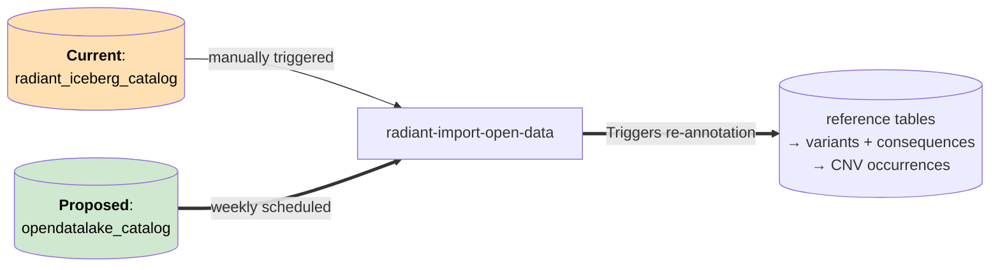
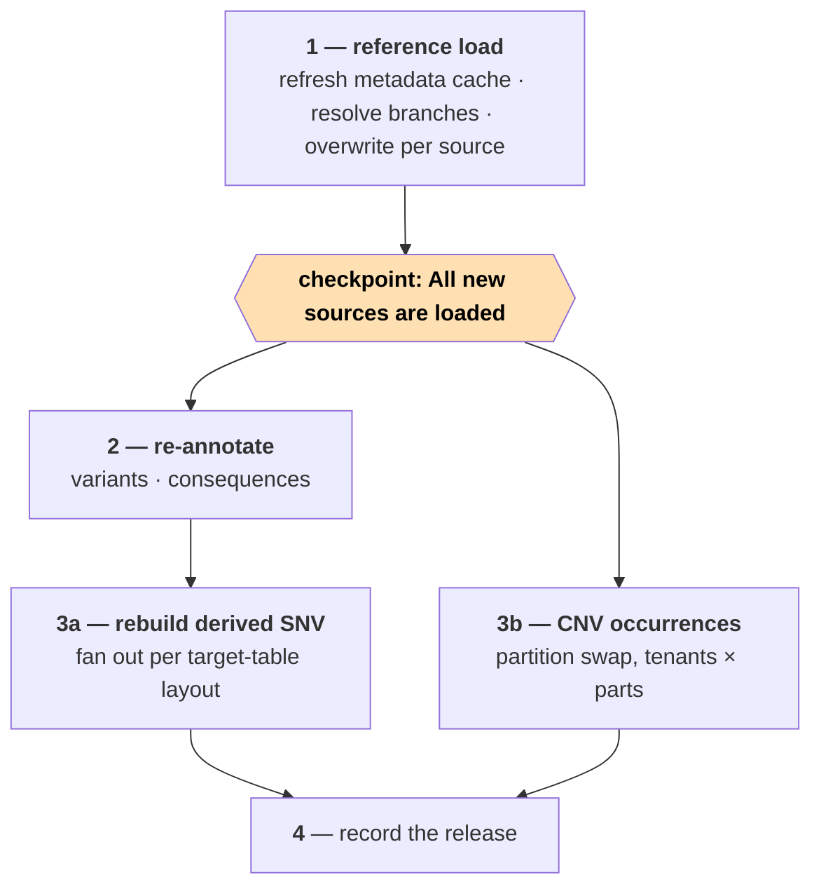
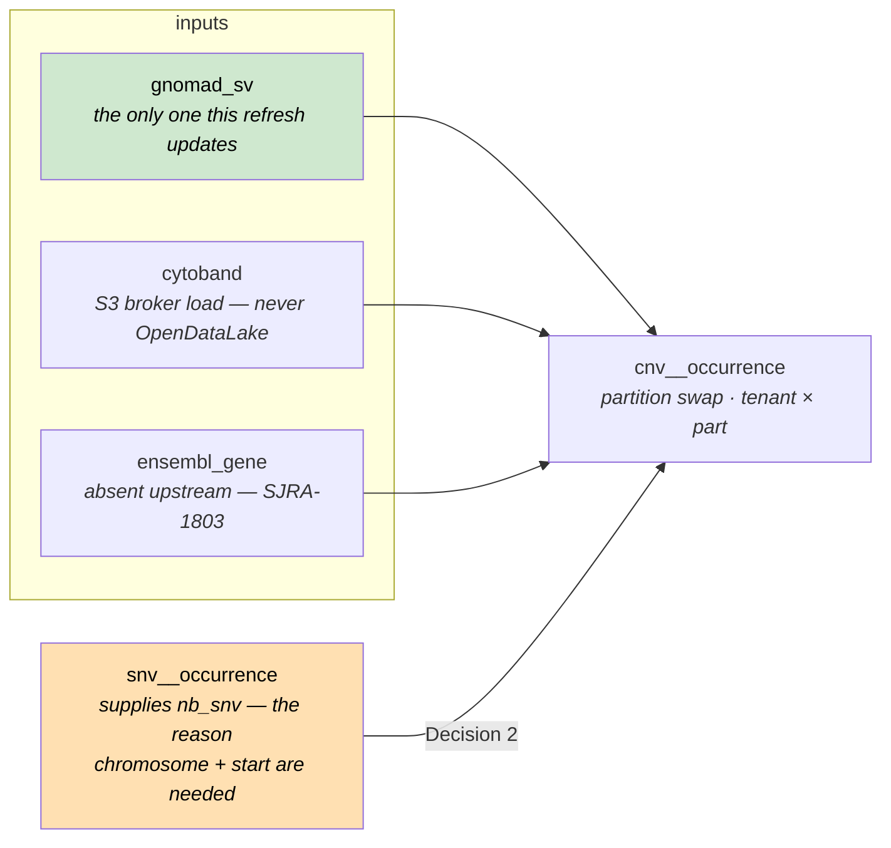
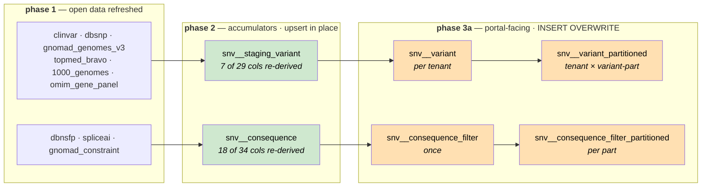

# OpenDataLake → Radiant ETL integration

## 1. Why

OpenDataLake tables are currently refreshed by hand. `radiant-import-open-data` is `schedule=None` and
triggered manually, so variant annotations are already stale for the open-data tables that update often.

**Deliver:** a weekly automatic refresh from OpenDataLake, variants re-annotated against it, and a record of
which release is in use.




---

## 2. Interface between the 2 systems

| Contract point | What OpenDataLake provides                                                             |
|----------------|----------------------------------------------------------------------------------------|
| Identity       | Each Radiant deployment can keep its own version for a table `{table_prefix}_v{MAJOR}` |
| Snapshot       | one Iceberg **branch per `dataset_version`**; branch name is the version               |
| Which branch   | discoverable in Iceberg metadata (`$refs` / `$snapshots`)                              |
| Access         | Use catalog (Glue or Polaris) for grants                                               |

**How do we resolve the latest version automatically?**

No `latest` pointer exists today, in SJRA-1546 §2.2 designs snapshot tagging, but it was never implemented.

**Decision 1 choices**:

- Option A: Implement `latest` snapshot tagging in the OpenDataLake ETL code.
- Option B: Look at the `committed_at` value of snapshots.

**Recommendation Option A**:
- Deterministic (if an older version is re-updated, we don't break)
- No guard on `audit_%` required to avoid picking up the audit branch

---

## 3. Coverage

Of the 20 tables Radiant consumes: **12 can move, 8 cannot.**

### ✅ Ready — 6

Contract table, auto-discovered upstream, and every payload column Radiant reads is present under the same name.

| Radiant             | OpenDataLake   | Columns read from OpenDataLake                              |
|---------------------|----------------|-------------------------------------------------------------|
| `clinvar`           | `clinvar_v1`   | 31 — near-full projection (see note)                        |
| `dbsnp`             | `dbsnp_v1`     | `name`                                                      |
| `hpo_term`          | `hpo_terms_v1` | `id`, `name`                                                |
| `mondo_term`        | `mondo_v1`     | `id`, `name`                                                |
| `ddd_gene_set`      | `ddd_v1`       | `symbol`, `disease_name`                                    |
| `orphanet_gene_set` | `orphanet_v1`  | `gene_symbol`, `name`, `disorder_id`, `type_of_inheritance` |

**ClinVar reads wide but annotates narrow.** `clinvar_insert.sql` copies 31 columns into the StarRocks
`clinvar` table (32 with the derived `locus_id`), but only **two** reach the annotation layer —
`name` and `interpretations`, via `snv_staging_variant_insert.sql`. `clinvar_rcv_summary_insert.sql` uses
`name` + `locus_id`. The other ~28 (`clin_sig`, `clnrevstat`, `conditions`, `inheritance`, `geneinfo`, …) are
served straight to the portal from that table and are joined by no pipeline SQL.

Useful consequence: for ClinVar, most of a refresh is live the moment phase 1 lands. Only `clinvar_name` and
`clinvar_interpretation` need phase 2 to reach the portal's variant tables.

### ✅ℹ️ Ready but manual — 4

Contract-backed and shape-compatible, but `UpdateMode.MANUAL`: no discovery task, so **they advance only when
a human triggers them**. Left alone they never update, which is the same stale-annotation problem this ticket
exists to remove — so someone has to own triggering them.

| Radiant        | OpenDataLake      | Where its version comes from                                            |
|----------------|-------------------|-------------------------------------------------------------------------|
| `dbnsfp`       | `dbnsfp_v1`       | `version` + `download_url` typed in at trigger time                     |
| `spliceai`     | `spliceai_v1`     | ETag pair of two fixed BaseSpace files — not a published release number |
| `1000_genomes` | `1000_genomes_v1` | fixed phase-3 URL, no checksum published                                |
| `gnomad_sv`    | `gnomad_sv_v1`    | the constant `4.1` in the producer's `gnomad.py`                        |

### 🔧 Shape mismatch — 2

Both have a contract table holding the data Radiant needs, under different column names.

#### 1. `gnomad_genomes_v3` → `gnomad_joint_v1`

This will be addressed by adding a new source if necessary. 

#### 2. `hpo_gene_set` → `hpo_genes_v1`

The contract table exists and is auto-discovered, but it is **deliberately faithful to the HPO source file**,
so its columns carry the upstream names rather than the platform's. A pure 3-column rename:

| `hpo_gene_panel_insert.sql` reads | `hpo_genes_v1` provides |
|-----------------------------------|-------------------------|
| `symbol`                          | `gene_symbol`           |
| `hpo_term_name`                   | `hpo_name`              |
| `hpo_term_id`                     | `hpo_id`                |

### ❌ Missing or unversioned — 8

| Radiant                   | Status                              | Ticket              |
|---------------------------|-------------------------------------|---------------------|
| `topmed_bravo`            | On hold, licensing validation       | SJRA-1794 *On Hold* |
| `omim_gene_set`           | On hold, licensing validation       | SJRA-1802 *On Hold* |
| `ensembl_gene`            | Not implemented yet (need analysis) | SJRA-1803 *Backlog* |
| `ensembl_exon_by_gene`    | Not implemented yet (need analysis) | SJRA-1803 *Backlog* |
| `gnomad_constraint`       | Not implemented yet                 | none                |
| `cytoband`                | Not implemented yet                 | none                |
| `raw_clinvar_rcv_summary` | Not implemented yet                 | none                |


### ⛔️Won't do
| Radiant                   | Status                              |
|---------------------------|-------------------------------------|
| `cosmic_gene_set`         | Not planned                         |

---

## 4. Design

- The refresh DAG is scheduled weekly (e.g.: Saturday at 00:00) and picks up updated tables in batch. 
- A missed/failed is not re-run and the next weekly update will catch up. 
- The DAG can be triggered manually by an operator if required. 

**Proposed design:** 
1. Update the `radiant-import-open-data` DAG to add the weekly update logic and reading latest version from the OpenDataLake
2. Import those tables locally and applied the necessary transformations for Radiant usage.
3. Implement a new DAG to perform table re-annotation. 

**Achieving mutual exclusion between step 3 and `import-radiant`:** 
- When starting, the import process must verify that the DAG `import_radiant` is not currently running.
- The update process also needs to grab the pool slot for `import_part` to ensure that an update is not running at the same time.




---

## 5. Re-annotation

Once the local StarRocks tables (with the updated OpenDataLake tables) are ready, we need to re-synchronize the values derived
from them in the StarRocks' Variant, Consequence and Occurrence tables and for both the CNVs and SNVs. 

| Family                      | Driven from                                                  |
|-----------------------------|--------------------------------------------------------------|
| SNV variants + consequences | themselves — they already hold every VEP column and join key |
| CNV occurrences             | the StarRocks occurrence tables                              |

**Important**: CNVs need extra work to ensure we don't rely on Iceberg tables (considered transient in the design).

**Decision 2 choices**:

- Option A: Add `chromosome` + `start` to the SNV occurrence tables at import, making step 3b StarRocks-only.
- Option B: Keep reading the Iceberg occurrence tables, widening `seq_ids` to the whole part.

**Recommendation Option A**:
- Removes the Iceberg retention dependency
- Keeps SNVs and CNVs annotation independent
- Only 2 additional columns to store in the Occurrences
- Cost: needs re-importing the existing data to add the extra columns



`nb_snv` counts the SNVs falling inside each CNV's interval, so the CNV statement has to join SNV occurrences
on coordinates. That join is the whole reason Decision 2 exists: today it reads them from Iceberg, and
`chromosome` + `start` are what let it read them from StarRocks instead.

Query example for re-annotation variants:

```sql
INSERT INTO {{ mapping.starrocks_snv_staging_variant }}
SELECT
    v.locus_id,
    g.af  AS gnomad_v3_af,           -- 7 re-derived from open data
    t.af  AS topmed_af,
    tg.af AS tg_af,
    v.chromosome, v.start, v.end,    -- 22 carried through unchanged
    cl.name AS clinvar_name,
    v.variant_class,
    cl.interpretations AS clinvar_interpretation,
    v.symbol, ... , v.is_canonical,
    d.rsnumber,
    v.reference, ... , v.transcript_id,
    om.inheritance_code AS omim_inheritance_code
FROM {{ mapping.starrocks_snv_staging_variant }} v   -- ← the only change: was snv_tmp_variant
LEFT JOIN {{ mapping.starrocks_gnomad_genomes_v3 }} g  ON g.locus_id = v.locus_id
LEFT JOIN {{ mapping.starrocks_topmed_bravo }}     t   ON t.locus_id = v.locus_id
LEFT JOIN {{ mapping.starrocks_1000_genomes }}     tg  ON tg.locus_id = v.locus_id
LEFT JOIN {{ mapping.starrocks_clinvar }}          cl  ON cl.locus_id = v.locus_id
LEFT JOIN {{ mapping.starrocks_dbsnp }}            d   ON d.locus_id = v.locus_id
LEFT JOIN (SELECT symbol, array_remove(array_unique_agg(inheritance_code), NULL) AS inheritance_code
           FROM {{ mapping.starrocks_omim_gene_panel }} GROUP BY symbol) om ON om.symbol = v.symbol;
```

Query example for re-annotation consequences:

```sql
INSERT INTO {{ mapping.starrocks_snv_consequence }}
SELECT
    c.locus_id, c.symbol, c.transcript_id,            -- 16 carried through (incl. the PK)
    c.consequences, c.impact_score, c.biotype,
    c.exon_rank, c.exon_total,                        -- flat columns here; c.exon.rank at ingest
    sp.spliceai_ds, sp.spliceai_type,                 -- 18 re-derived from open data
    c.is_canonical, ... , c.mane_select,
    d.sift_score, ... , d.lrt_pred,
    gc.pli, gc.loeuf,                                 -- land in gnomad_pli / gnomad_loeuf
    d.phyloP17way_primate, d.phyloP100way_vertebrate,
    c.vep_impact, c.aa_change, c.dna_change
FROM {{ mapping.starrocks_snv_consequence }} c         -- ← was iceberg_snv_consequence
LEFT JOIN {{ mapping.starrocks_dbnsfp }}   d  ON d.locus_id = c.locus_id
                                             AND d.ensembl_transcript_id = c.transcript_id
LEFT JOIN {{ mapping.starrocks_spliceai }} sp ON sp.locus_id = c.locus_id AND sp.symbol = c.symbol
LEFT JOIN {{ mapping.starrocks_gnomad_constraint }} gc ON gc.transcript_id = c.transcript_id;
```

**Decision 3 choices**:

- Option A: Upsert in place.
- Option B: Write into a **second table of identical schema**, then `ALTER TABLE … SWAP WITH` the live one.

**Recommendation Option A**:
- Fewer moving pieces and consideration (co-locate groups, schemas, etc...)
- Very similar query to what already exist to build the Variant staging table in the first place. 
- No extra swap table necessary.
- Cost: Slower and heavier than a SWAP, but conceptually simpler.

The following tables need to be re-ingested to ensure all rows are updated with new values:

|  Target                                                      | Runs                                     |
|--------------------------------------------------------------|------------------------------------------|
|  `snv__variant` — per-tenant, unpartitioned                  | per tenant                               |
|  `snv__variant_partitioned` — per-tenant, partitioned        | tenant × variant-part                    |
|  `snv__consequence_filter` — shared, unpartitioned           | once                                     |
|  `snv__consequence_filter_partitioned` — shared, partitioned | per part (tenants pooled inside the SQL) |

Only the second is genuinely tenant × part. Note also that a **variant-part is 10 occurrence-parts**
(`part // 10`), so that step's cardinality is tenants × parts/10, not tenants × parts.

**Those four are not independent — they are two serial pairs.** Each partitioned table is a partitioned copy of
the unpartitioned one above it, so the copy has to be rebuilt first:



Top row and bottom row are independent; left-to-right inside a row is not.

`snv_variant_part_insert_part.sql:2-6` is literally `SELECT %(variant_part)s AS part, v.* FROM
{{ mapping.starrocks_snv_variant }} v`, and `snv_consequence_filter_insert.sql:78` reads
`{{ mapping.starrocks_snv_consequence }}`. So 3a parallelises **across** the two chains and within each chain's
tenant/part fan-out, never between a table and its own partitioned copy.

This is also why phase 2 cannot be skipped for a source whose values only reach the portal through
`snv__variant`: nothing downstream re-reads open data, it only re-reads the accumulator.

The partitioned copies exist so portal queries prune to the partitions holding the experiments in scope.
`import_part` writes only the one part it is processing; a re-annotation has to cover them all — that
difference *is* the cost.

Frequencies are **not** recomputed: they derive from occurrences, never from open data.


