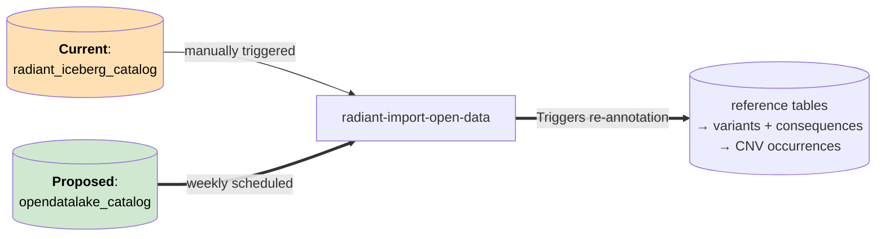
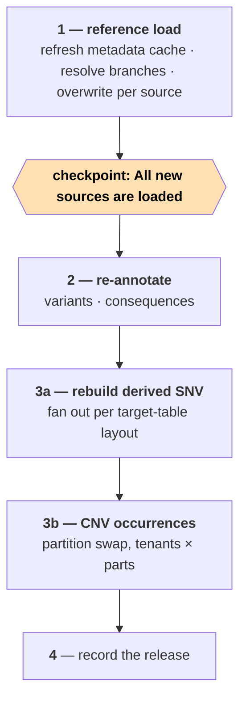
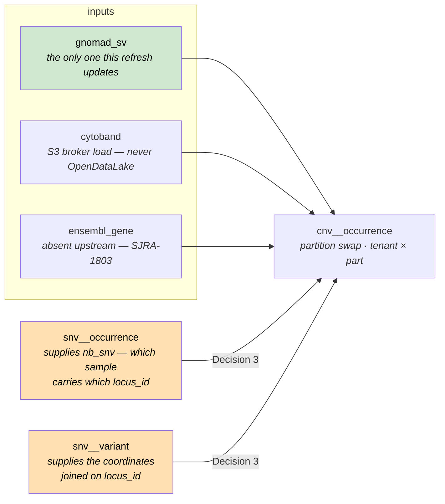
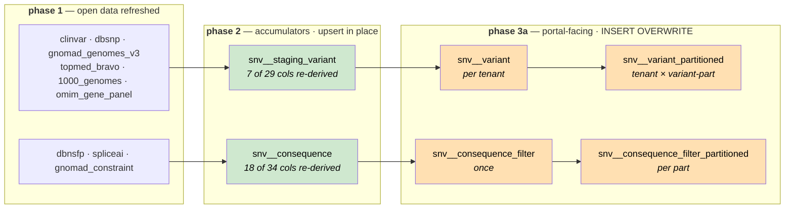

# OpenDataLake → Radiant ETL integration

## 1. Why

OpenDataLake tables are currently refreshed by hand. `radiant-import-open-data` is `schedule=None` and
triggered manually, so variant annotations are already stale for the open-data tables that update often.

**Deliver:** a weekly automatic refresh from OpenDataLake, variants re-annotated against it, and a record of
which release is in use.




---

## 2. Interface between the 2 systems

| Contract point | What OpenDataLake provides                                                             |
|----------------|----------------------------------------------------------------------------------------|
| Identity       | Each Radiant deployment can keep its own version for a table `{table_prefix}_v{MAJOR}` |
| Snapshot       | one Iceberg **branch per `dataset_version`**; branch name is the version               |
| Which branch   | discoverable in Iceberg metadata (`$refs` / `$snapshots`)                              |
| Access         | Use catalog (Glue or Polaris) for grants                                               |

**How do we resolve the latest version automatically?**

No `latest` pointer exists today, in SJRA-1546 §2.2 designs snapshot tagging, but it was never implemented.

**Decision 1 choices**:

- Option A: Implement `latest` snapshot tagging in the OpenDataLake ETL code.
- Option B: Look at the `committed_at` value of snapshots.

**Recommendation Option A**:
- Deterministic (if an older version is re-updated, we don't break)
- No guard on `audit_%` required to avoid picking up the audit branch

---

## 3. Coverage

Of the 20 tables Radiant consumes: **15 can move, 5 cannot.**

### ✅ Ready — 6

Contract table, auto-discovered upstream, and every payload column Radiant reads is present under the same name.

| Radiant             | OpenDataLake   | Columns read from OpenDataLake                              |
|---------------------|----------------|-------------------------------------------------------------|
| `clinvar`           | `clinvar_v1`   | 31 — near-full projection (see note)                        |
| `dbsnp`             | `dbsnp_v1`     | `name`                                                      |
| `hpo_term`          | `hpo_terms_v1` | `id`, `name`                                                |
| `mondo_term`        | `mondo_v1`     | `id`, `name`                                                |
| `ddd_gene_set`      | `ddd_v1`       | `symbol`, `disease_name`                                    |
| `orphanet_gene_set` | `orphanet_v1`  | `gene_symbol`, `name`, `disorder_id`, `type_of_inheritance` |

**ClinVar reads wide but annotates narrow.** `clinvar_insert.sql` copies 31 columns into the StarRocks
`clinvar` table (32 with the derived `locus_id`), but only **two** reach the annotation layer —
`name` and `interpretations`, via `snv_staging_variant_insert.sql`. `clinvar_rcv_summary_insert.sql` uses
`name` + `locus_id`. The other ~28 (`clin_sig`, `clnrevstat`, `conditions`, `inheritance`, `geneinfo`, …) are
served straight to the portal from that table and are joined by no pipeline SQL.

Useful consequence: for ClinVar, most of a refresh is live the moment phase 1 lands. Only `clinvar_name` and
`clinvar_interpretation` need phase 2 to reach the portal's variant tables.

### ✅ℹ️ Ready but manual — 7

Contract-backed and shape-compatible, but `UpdateMode.MANUAL`: no discovery task, so **they advance only when
a human triggers them**. Left alone they never update, which is the same stale-annotation problem this ticket
exists to remove — so someone has to own triggering them.

| Radiant             | OpenDataLake          | Where its version comes from                                            |
|---------------------|-----------------------|-------------------------------------------------------------------------|
| `dbnsfp`            | `dbnsfp_v1`           | `version` + `download_url` typed in at trigger time                     |
| `spliceai`          | `spliceai_v1`         | ETag pair of two fixed BaseSpace files — not a published release number |
| `1000_genomes`      | `1000_genomes_v1`     | fixed phase-3 URL, no checksum published                                |
| `gnomad_sv`         | `gnomad_sv_v1`        | the constant `4.1` in the producer's `gnomad.py`                        |
| `topmed_bravo`      | `topmed_bravo_v1`     | operator supplies it (`source_configs/topmed.py`)                       |
| `omim_gene_set`     | `omim_v1`             | `genemap2.txt` release typed in at trigger time                         |
| `gnomad_constraint` | `gnomad_constraint_v1`| pinned in the producer's `gnomad.py`                                    |

The last three were blocked when this was written — `topmed_bravo` and `omim_gene_set` on licensing
validation (SJRA-1794, SJRA-1802), `gnomad_constraint` unimplemented. All three have shipped since
(contracts dated 2026-08-10, 2026-08-13 and 2026-09-01), and each is a pure table rename: every column
`topmed_bravo_insert.sql`, `omim_gene_panel_insert.sql` and `gnomad_constraint_insert.sql` reads is present
upstream under the same name.

**`gnomad_sv` is the one exception to "shape-compatible" here.** `gnomad_sv_v1` publishes PASS rows only and
drops the `filters` column, so the two CNV occurrence statements keep a
`` around their `filters = 'PASS'` predicate — without it,
a source held back on the pre-contract table would quietly annotate against non-PASS calls.

### 🔧 Shape mismatch — 2

Both have a contract table holding the data Radiant needs, under different column names.

#### 1. `gnomad_genomes_v3` → `gnomad_joint_v1`

**These are not the same dataset.** The move changes the gnomAD release *and* the callset at once:

|             | `gnomad_genomes_v3` (legacy) | `gnomad_joint_v1` (contract)                |
|-------------|------------------------------|---------------------------------------------|
| Release     | v3.x                         | **v4.1**                                    |
| Callset     | genomes only                 | **joint — exomes + genomes**                |
| Individuals | 76,156 genomes               | **730,947 exomes + 76,215 genomes = 807,162** |

(`spark/doc/release-notes/gnomad_joint/v1.md`; `source_configs/gnomad.py:9` pins `JOINT_VERSION = "4.1"`.)

So the `` in `gnomad_insert.sql` is not choosing between two spellings of one number — it is choosing
between two different population frequencies. Allele frequencies move for essentially every variant, ~10.6×
more individuals contribute, and the variant set itself differs.

**The names downstream are now wrong.** The StarRocks target keeps the name `gnomad_genomes_v3` with
unsuffixed columns, `snv_staging_variant_insert.sql:4` writes `g.af AS gnomad_v3_af`, and the portal renders
that field with the literal label **"gnomAD Genome 3.1.2"** (`frontend/translations/common/{en,fr}.json`).
A clinician would be reading v4.1 joint frequencies under a v3.1.2 heading.

The contract publishes three frequency families — `*_joint`, `*_genomes` and `*_exomes` — so continuity is
available as well as the upgrade.

**Decision 5 choices**:

- Option A: Read `*_joint`, keep the `gnomad_v3_af` field name, and fix the user-facing label only.
- Option B: Read `*_genomes` — v4.1 genomes only, 76,215 against v3.1's 76,156, i.e. the same statistic on a
  refreshed cohort.
- Option C: Read `*_joint` and rename end to end — StarRocks table, column, API field, facet key, i18n.

**Recommendation Option A**:

- The joint callset is gnomAD's recommended default for population allele frequency, and for coding variants
  it is roughly an order of magnitude more powered than genomes alone. Option B trades away the main reason
  to migrate.
- The defect is the label, not the data. `gnomad_v3_af` is an identifier; "gnomAD Genome 3.1.2" is a claim.
  Fixing the claim is ~6 strings in `en.json` / `fr.json`; renaming the identifier is ~120 references across
  three repos plus a breaking API change and a migration for saved filters that reference the facet key.
- Option C is the right end state, but it belongs to its own ticket rather than riding on this migration.

**Caveat to carry into Option A:** in the joint callset `AN` varies by region — exomes do not cover
non-coding positions, so only the ~76k genomes contribute there. Today this is latent: `gnomad_insert.sql`
loads `af`, `ac`, `an` and `nhomalt`, but only `af` propagates (`snv_staging_variant_insert.sql:4`), and
nothing filters on `AN`. Anything that later surfaces `AN` or assumes a stable denominator has to account
for it.

#### 2. `hpo_gene_set` → `hpo_genes_v1`

The contract table exists and is auto-discovered, but it is **deliberately faithful to the HPO source file**,
so its columns carry the upstream names rather than the platform's. A pure 3-column rename:

| `hpo_gene_panel_insert.sql` reads | `hpo_genes_v1` provides |
|-----------------------------------|-------------------------|
| `symbol`                          | `gene_symbol`           |
| `hpo_term_name`                   | `hpo_name`              |
| `hpo_term_id`                     | `hpo_id`                |

### ❌ Missing or unversioned — 4

No contract upstream, so these stay on `radiant_iceberg_catalog` (`ICEBERG_OPEN_DATA_LEGACY_MAPPING`) or,
for the last two, on their S3 broker loads.

| Radiant                   | Status                              | Ticket              |
|---------------------------|-------------------------------------|---------------------|
| `ensembl_gene`            | Not implemented yet (need analysis) | SJRA-1803 *Backlog* |
| `ensembl_exon_by_gene`    | Not implemented yet (need analysis) | SJRA-1803 *Backlog* |
| `cytoband`                | Not implemented yet — broker load   | none                |
| `raw_clinvar_rcv_summary` | Not implemented yet — broker load   | none                |

`cytoband` and `raw_clinvar_rcv_summary` are file-driven: `import_open_data` skips both unless the caller
passes `cytoband_filepath` / `raw_rcv_filepaths`, so they are not part of the weekly refresh at all.


### ⛔️Won't do
| Radiant                   | Status                              |
|---------------------------|-------------------------------------|
| `cosmic_gene_set`         | Not planned                         |

---

## 4. Design

- The refresh DAG is scheduled weekly (e.g.: Saturday at 00:00) and picks up updated tables in batch. 
- A missed/failed is not re-run and the next weekly update will catch up. 
- The DAG can be triggered manually by an operator if required. 

**Proposed design:** 
1. Update the `radiant-import-open-data` DAG to add the weekly update logic and reading latest version from the OpenDataLake
2. Import those tables locally and applied the necessary transformations for Radiant usage.
3. Implement a new DAG to perform table re-annotation. 

**Achieving mutual exclusion between step 3 and `import-radiant`:**

An Airflow pool slot is released the instant the *task* holding it finishes — not when the *DAG run*
finishes. The re-annotation DAG is multiple tasks (P1 → P2 → P3A/P3B → P4 below), so a pool acquired by its
first task would already be free again by the time P2 starts, leaving a window for `import_radiant` to slip
in between — exactly the overlap this is meant to prevent. A pool caps concurrent *task* count; it can't
express "this whole run must finish before that run starts." A real lock needs an atomic test-and-set held
for the whole run.

**Decision 2 choices**:

- Option A: A lock row in Airflow's own Postgres metadata DB (`INSERT ... ON CONFLICT DO NOTHING`).
- Option B: A dedicated DynamoDB table with a conditional `PutItem`.
- Option C: An S3 conditional write (`If-None-Match: *`) on a lock object in the Airflow DAGs bucket
  (`dags/`, `plugins/`, `startup/`) already provisioned for this environment.

**Recommendation Option C**:

- No new infra to provision or get signed off — reuses the bucket already backing this Airflow
  environment, just one more key under it (e.g. `s3://<airflow-dags-bucket>/_locks/import_mutex`).
- Native atomic guarantee: `PutObject` with header `If-None-Match: *` only succeeds if the key doesn't
  already exist, otherwise `412 PreconditionFailed` — no extra round trip to fake the check.
- No cost against the MinIO fixture. An earlier draft of this section claimed MinIO rejects the `*`
  wildcard and requires a concrete ETag, citing [minio/minio#20346](https://github.com/minio/minio/issues/20346).
  That issue is the stale framing: MinIO enforces put-if-absent from `RELEASE.2024-09-13T20-26-02Z`
  (see [discussion #20318](https://github.com/minio/minio/discussions/20318)), and both images this repo
  pins are newer — `RELEASE.2024-10-29T16-01-48Z` in `docker-compose.yml`, `RELEASE.2025-09-07T16-13-09Z`
  in `tests/integration/fixtures_docker.py`. Verified directly against both: the second conditional put
  returns `PreconditionFailed`. The create-only-if-absent call is therefore exercised identically on the
  docker-fixture path and on real S3.

**Why not Option A (Postgres metadata DB)?**

On Amazon MWAA the Aurora Postgres metadata DB isn't reachable from DAG/task code. Per AWS's docs on
[Aurora PostgreSQL database cleanup on an Amazon MWAA
environment](https://docs.aws.amazon.com/mwaa/latest/userguide/samples-database-cleanup.html):
"Apache Airflow v3 restricts direct metadata database access from task code. Workers no longer connect to
the metadata database, and DAG or task code can't import or use Apache Airflow database sessions or models
directly."

**Why not Option B (DynamoDB)?**

Ruled out on cost/ops grounds: a new managed AWS service, provisioned, monitored, and paid for, with no
other use anywhere in this pipeline.

**Mechanics**:

- **Acquire** — first task of `import_part` (per triggered partition run) and of the re-annotation DAG:
  `PutObject(key="_locks/import_mutex", IfNoneMatch="*")`. A `412 PreconditionFailed` means the other
  side holds it → the task fails outright (no retry). Lock acquire/release belongs in `import_part`, not
  `import_radiant`: `import_radiant` only fetches the delta and triggers partitions, it holds no
  Iceberg/StarRocks writes itself — the writes that must not race the re-annotation DAG happen in
  `import_part`. This adds the piece a pool can't express: exclusion against the re-annotation DAG's
  whole multi-task run.

  > **Corrected 2026-09-21.** This paragraph used to claim `import_part` "already runs one partition at
  > a time (pool `import_part`, a single slot held by `import_radiant`'s trigger task for the whole
  > partition run)". It did not. The trigger holds that slot only while it is *running*; where
  > `[operators] default_deferrable` is on it defers while waiting, and a deferred task holds no slot
  > (`EXECUTION_STATES` is `{RUNNING, QUEUED}` — apache/airflow#40528), so the next partition started
  > immediately and two runs raced the lock. The pool needs `include_deferred`, and the real constraint
  > now lives on the DAG as `max_active_runs=1`, which also covers manual and API-triggered runs the
  > caller's pool never saw. See `radiant/dags/docs/import_part.md`.
- **Release** — the last task of each DAG releases: `import_part` after both final sequencing-experiment
  update tasks, the re-annotation DAG after P4.

  > **Amended 2026-09-21.** This used to read "A failed or partially-skipped run does not release — the
  > lock stays held", for both DAGs. That now holds only for the re-annotation DAG, which is one long
  > run whose half-finished state an operator should inspect before anything else writes. `import_part`
  > releases on `ALL_DONE` instead: it runs once per partition and fails routinely, and holding the
  > mutex on failure took every partition behind it down too. Because `ALL_DONE` fires even when
  > `acquire_import_lock` itself failed, the release is holder-checked — a run that lost the race
  > deletes nothing, rather than freeing the winner's lock.
- **No automatic reclaim.** Acquire never deletes an existing lock, however old. `import_part` failures
  are routine and get restarted by an operator; an automatic stale-lock reclaim would let that restart
  race whatever legitimately still holds the lock. Clearing an abandoned lock is instead a deliberate,
  separate action: the toolbox DAG's `check-lock` command reports the current lock's holder and age, and only
  deletes it when the operator explicitly passes `-delete-if-expired` (via toolbox's `args` param)
  *and* the lock is past its 6h TTL — never automatically, and never for a lock still within its
  TTL regardless of the flag.




### Rollout — the cutover is a config change, not a deploy

`RADIANT_OPEN_DATA_USE_LEGACY_TABLES` defaults to `*`: **every** contract source held back on its
pre-contract Radiant Iceberg table. An environment that upgrades to this wheel without being configured
for OpenDataLake therefore reads exactly what it read before. Migrating is then one explicit step per
environment — set the variable to `""` for all 15 sources, or to a shorter list to move part way — and
rolling back is the same step in reverse, with no code change.

The sentinel is spelled `*` rather than a literal list of the 15 names so that a table added to
`ICEBERG_OPEN_DATA_CONTRACT_MAPPING` later cannot default to OpenDataLake by omission. It is honoured only
as the whole value; `*` mixed into a list is rejected as an unknown source, like any other typo.

### Metadata-cache refresh — both DAGs that read open data

`latest` is a tag OpenDataLake moves on each publish and StarRocks caches external-catalog metadata, so
every DAG that reads a contract table must refresh it first (P1). `import-open-data` refreshes all 18
open-data tables, but it is `schedule=None`. `import_part` reads one of them on its own schedule — the CNV
enrichment joins `gnomad_sv_v1` straight from Iceberg — so it refreshes that source too, rather than
relying on a manual DAG having been run. Its `get_tables_to_refresh` names that source inline; a unit test
reads both that `keys=` list and every `mapping.iceberg_*` reference under `sql/radiant/`, so a newly
referenced open-data source cannot be left unrefreshed.

---

## 5. Re-annotation

Once the local StarRocks tables (with the updated OpenDataLake tables) are ready, we need to re-synchronize the values derived
from them in the StarRocks' Variant, Consequence and Occurrence tables and for both the CNVs and SNVs. 

| Family                      | Driven from                                                  |
|-----------------------------|--------------------------------------------------------------|
| SNV variants + consequences | themselves — they already hold every VEP column and join key |
| CNV occurrences             | the StarRocks occurrence tables                              |

**Important**: CNVs need extra work to ensure we don't rely on Iceberg tables (considered transient in the design).

**Decision 3 choices**:

- Option A: Add `chromosome` + `start` to the SNV occurrence tables at import, making step 3b StarRocks-only.
- Option B: Keep reading the Iceberg occurrence tables, widening `seq_ids` to the whole part.
- Option C: Take the coordinates from a variant table, joined to the SNV occurrences on `locus_id`.

**Chosen: Option C**:
- Removes the Iceberg retention dependency, exactly as A does
- No schema change and no re-import: the coordinates are already stored, one join away
- Cost: in `import_part` the CNV load becomes its own Phase 5, running once Phase 4 is complete. Only
  `tg_variants` is a real dependency; waiting for the whole phase keeps the flow serial and easy to follow
- Cost: one extra join per CNV load. Not yet measured — the two tables are both
  `DISTRIBUTED BY HASH(locus_id) BUCKETS 10` but sit in different databases (tenant vs base), and
  StarRocks scopes colocate groups per database, so they are not colocated and the planner shuffles

The variant table is the per-tenant **`snv__variant`**, and this narrows what `nb_snv` means — accepted
deliberately. `snv__variant` is restricted, via `LEFT SEMI JOIN tenant_loci` in `snv_variant_insert.sql`,
to loci that reached a frequency table, and those are built with `gq >= 20`, `filter = 'PASS'` and
`ad_alt > 3` (germline) or `filter = 'PASS'` and `tumor_ad_alt > 2` (somatic). So `nb_snv` counts the
**quality-passing** SNVs inside a segment, not every SNV: an occurrence whose locus cleared none of those
gates is absent from `snv__variant` and drops out of the join, and a segment whose only SNVs are
non-qualifying now reports NULL rather than a count.

The alternative was `snv__staging_variant`, which holds every locus ever imported — it is upserted from
`snv__tmp_variant`, the same table the occurrence insert resolves its `locus_id` through, so an occurrence
row can never reference a locus missing from it. That preserves the old count exactly. It was rejected on
provenance rather than correctness: it is a base-database, cross-tenant table whose name reads as
transient, and a per-tenant CNV load reading it couples the two. Counting only variants the platform
considers real was judged the better contract.

**Corrected during implementation — step 3b runs after 3a's variant chain, not beside it.** The original
argument was that `locus_id`, `chromosome` and `start` are carried through re-annotation unchanged, so the
CNV rebuild does not care whether the SNV rebuild has run. That holds for those column *values*, but the
join above produces `COUNT(DISTINCT s.locus_id)` — it depends on which **rows** `snv__variant` contains,
and `snv_variant_insert.sql` rebuilds that table with `INSERT OVERWRITE`. In a pure re-annotation the row
set does happen to be identical on both sides of the overwrite, since no new experiments arrived and the
frequency tables the row set derives from are untouched; but nothing enforces that, and if it ever stops
being true the CNV counts go stale silently, with no failure to notice. The re-annotation DAG therefore
wires `insert_snv_variant >> cnv_occurrence`. It costs the 3a/3b overlap. The consequence chain still runs
beside 3b — no CNV statement reads a consequence table.



`nb_snv` counts the SNVs falling inside each CNV's interval, so the CNV statement has to join SNV occurrences
on coordinates. That join is the whole reason Decision 3 exists: today it reads them from Iceberg, which is
the dependency to remove. The occurrence tables store no coordinates, only `locus_id` — so the coordinates
come from the variant table that `locus_id` points into, and both sides of the join live in StarRocks.

Query example for re-annotation variants:

```sql
INSERT INTO {{ mapping.starrocks_snv_staging_variant }}
SELECT
    v.locus_id,
    g.af  AS gnomad_v3_af,           -- 7 re-derived from open data
    t.af  AS topmed_af,
    tg.af AS tg_af,
    v.chromosome, v.start, v.end,    -- 22 carried through unchanged
    cl.name AS clinvar_name,
    v.variant_class,
    cl.interpretations AS clinvar_interpretation,
    v.symbol, ... , v.is_canonical,
    d.rsnumber,
    v.reference, ... , v.transcript_id,
    om.inheritance_code AS omim_inheritance_code
FROM {{ mapping.starrocks_snv_staging_variant }} v   -- ← the only change: was snv_tmp_variant
LEFT JOIN {{ mapping.starrocks_gnomad_genomes_v3 }} g  ON g.locus_id = v.locus_id
LEFT JOIN {{ mapping.starrocks_topmed_bravo }}     t   ON t.locus_id = v.locus_id
LEFT JOIN {{ mapping.starrocks_1000_genomes }}     tg  ON tg.locus_id = v.locus_id
LEFT JOIN {{ mapping.starrocks_clinvar }}          cl  ON cl.locus_id = v.locus_id
LEFT JOIN {{ mapping.starrocks_dbsnp }}            d   ON d.locus_id = v.locus_id
LEFT JOIN (SELECT symbol, array_remove(array_unique_agg(inheritance_code), NULL) AS inheritance_code
           FROM {{ mapping.starrocks_omim_gene_panel }} GROUP BY symbol) om ON om.symbol = v.symbol;
```

Query example for re-annotation consequences:

```sql
INSERT INTO {{ mapping.starrocks_snv_consequence }}
SELECT
    c.locus_id, c.symbol, c.transcript_id,            -- 16 carried through (incl. the PK)
    c.consequences, c.impact_score, c.biotype,
    c.exon_rank, c.exon_total,                        -- flat columns here; c.exon.rank at ingest
    sp.spliceai_ds, sp.spliceai_type,                 -- 18 re-derived from open data
    c.is_canonical, ... , c.mane_select,
    d.sift_score, ... , d.lrt_pred,
    gc.pli, gc.loeuf,                                 -- land in gnomad_pli / gnomad_loeuf
    d.phyloP17way_primate, d.phyloP100way_vertebrate,
    c.vep_impact, c.aa_change, c.dna_change
FROM {{ mapping.starrocks_snv_consequence }} c         -- ← was iceberg_snv_consequence
LEFT JOIN {{ mapping.starrocks_dbnsfp }}   d  ON d.locus_id = c.locus_id
                                             AND d.ensembl_transcript_id = c.transcript_id
LEFT JOIN {{ mapping.starrocks_spliceai }} sp ON sp.locus_id = c.locus_id AND sp.symbol = c.symbol
LEFT JOIN {{ mapping.starrocks_gnomad_constraint }} gc ON gc.transcript_id = c.transcript_id;
```

**Decision 4 choices**:

- Option A: Upsert in place.
- Option B: Write into a **second table of identical schema**, then `ALTER TABLE … SWAP WITH` the live one.

**Recommendation Option A**:
- Fewer moving pieces and consideration (co-locate groups, schemas, etc...)
- Very similar query to what already exist to build the Variant staging table in the first place. 
- No extra swap table necessary.
- Cost: Slower and heavier than a SWAP, but conceptually simpler.

The following tables need to be re-ingested to ensure all rows are updated with new values:

|  Target                                                      | Runs                                     |
|--------------------------------------------------------------|------------------------------------------|
|  `snv__variant` — per-tenant, unpartitioned                  | per tenant                               |
|  `snv__variant_partitioned` — per-tenant, partitioned        | tenant × variant-part                    |
|  `snv__consequence_filter` — shared, unpartitioned           | once                                     |
|  `snv__consequence_filter_partitioned` — shared, partitioned | per part (tenants pooled inside the SQL) |

Only the second is genuinely tenant × part. Note also that a **variant-part is 10 occurrence-parts**
(`part // 10`), so that step's cardinality is tenants × parts/10, not tenants × parts.

**Those four are not independent — they are two serial pairs.** Each partitioned table is a partitioned copy of
the unpartitioned one above it, so the copy has to be rebuilt first:



Top row and bottom row are independent; left-to-right inside a row is not.

**Corrected during implementation — the two rows are run serially anyway.** The independence above is a
statement about *data*, and it still holds: nothing in the consequence chain reads anything the variant
chain writes. It does not follow that they should run at the same time. Every statement in both rows is a
whole-table scan rather than a batch, so running two concurrently puts them in contention for the same
disk and spill budget on the StarRocks cluster, and that costs more than the overlap wins. The
re-annotation DAG therefore chains all of P2, P3a and P3b into one serial spine, and each mapped fan-out
carries `max_active_tis_per_dagrun=1` so a tenant/part expansion cannot parallelise from the inside
either.

Note this is wired with DAG edges, not with the `starrocks_insert_pool` constant that exists in
`operator.py`. A pool cannot express it: these operators `SUBMIT TASK` and then defer, so the statement is
running while the Airflow task sits in `DEFERRED` — and a deferred task occupies a pool slot only when the
pool was created with `include_deferred=True` (Airflow 2.10 `Pool.get_occupied_states`). That is
cluster-side configuration the DAG cannot assert, and a pool created without it would serialise only the
brief submit while every query still overlapped, with nothing to show that it had failed to work. This is
the same trap as §4's pool-versus-lock argument, one layer down.

`snv_variant_part_insert_part.sql:2-6` is literally `SELECT %(variant_part)s AS part, v.* FROM
{{ mapping.starrocks_snv_variant }} v`, and `snv_consequence_filter_insert.sql:78` reads
`{{ mapping.starrocks_snv_consequence }}`. So 3a parallelises **across** the two chains and within each chain's
tenant/part fan-out, never between a table and its own partitioned copy.

This is also why phase 2 cannot be skipped for a source whose values only reach the portal through
`snv__variant`: nothing downstream re-reads open data, it only re-reads the accumulator.

The partitioned copies exist so portal queries prune to the partitions holding the experiments in scope.
`import_part` writes only the one part it is processing; a re-annotation has to cover them all — that
difference *is* the cost.

Frequencies are **not** recomputed: they derive from occurrences, never from open data.

---

## 6. Decisions summary

| # | Decision | Chosen | Why |
|---|----------|--------|-----|
| 1 | Resolving the latest OpenDataLake table version (§2) | **A** — implement `latest` snapshot tagging in the OpenDataLake ETL | Deterministic even if an older version is re-updated; no need to guard against picking up the `audit_%` branch |
| 2 | Mutual exclusion between the re-annotation DAG and `import_radiant` (§4) | **C** — S3 conditional write (`If-None-Match: *`) on a lock object | No new infra to provision; native atomic guarantee. A Postgres metadata-DB row (A) is blocked on MWAA; DynamoDB (B) isn't justified for one mutex |
| 3 | Source for the CNV re-annotation's SNV coordinate join (§5) | **C** — join `snv__occurrence` to the per-tenant `snv__variant` on `locus_id` | Drops the Iceberg-retention dependency with no schema change and no re-import; keeps the read inside the tenant database; costs one ordering edge in `import_part`, and narrows `nb_snv` to quality-passing SNVs |
| 4 | How re-derived values reach the portal-facing SNV tables (§5) | **A** — upsert in place | Fewer moving pieces; mirrors the existing staging-variant build query; no extra swap table to maintain |


