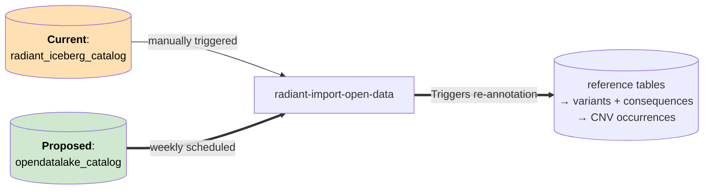
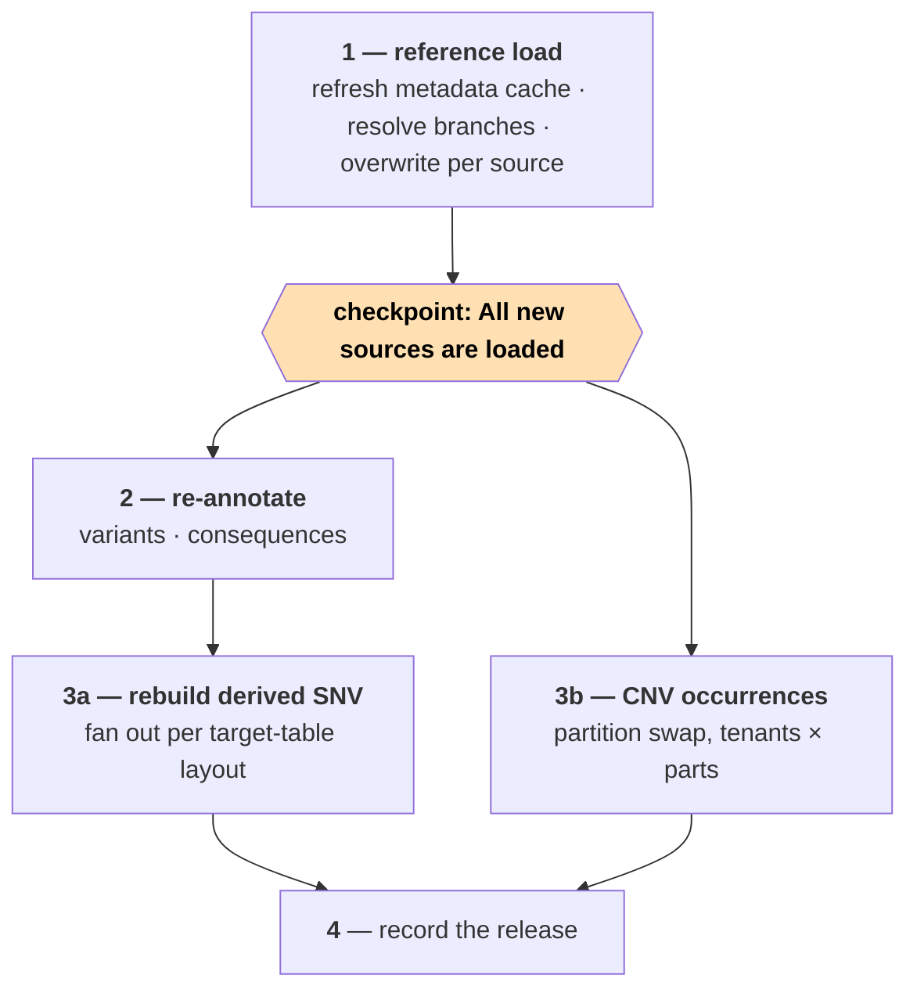
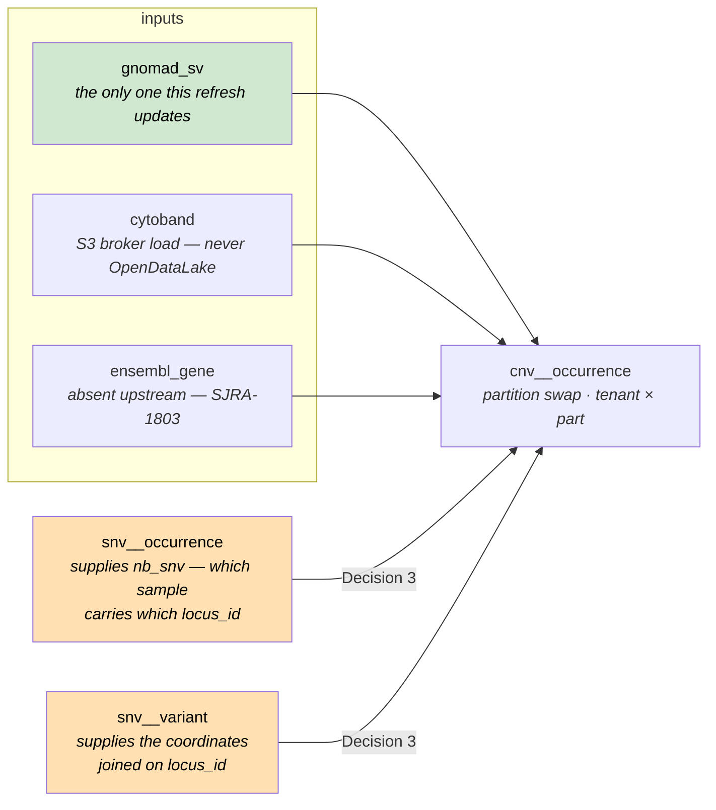
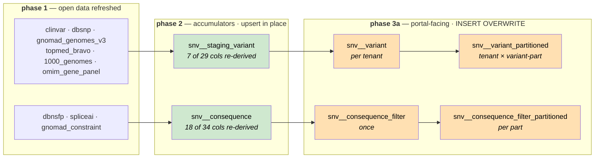

# OpenDataLake → Radiant ETL integration

## 1. Why

OpenDataLake tables are currently refreshed by hand. `radiant-import-open-data` is `schedule=None` and
triggered manually, so variant annotations are already stale for the open-data tables that update often.

**Deliver:** a weekly automatic refresh from OpenDataLake, variants re-annotated against it, and a record of
which release is in use.




---

## 2. Interface between the 2 systems

| Contract point | What OpenDataLake provides                                                             |
|----------------|----------------------------------------------------------------------------------------|
| Identity       | Each Radiant deployment can keep its own version for a table `{table_prefix}_v{MAJOR}` |
| Snapshot       | one Iceberg **branch per `dataset_version`**; branch name is the version               |
| Which branch   | discoverable in Iceberg metadata (`$refs` / `$snapshots`)                              |
| Access         | Use catalog (Glue or Polaris) for grants                                               |

**How do we resolve the latest version automatically?**

No `latest` pointer exists today, in SJRA-1546 §2.2 designs snapshot tagging, but it was never implemented.

**Decision 1 choices**:

- Option A: Implement `latest` snapshot tagging in the OpenDataLake ETL code.
- Option B: Look at the `committed_at` value of snapshots.

**Recommendation Option A**:
- Deterministic (if an older version is re-updated, we don't break)
- No guard on `audit_%` required to avoid picking up the audit branch

---

## 3. Coverage

Of the 20 tables Radiant consumes: **12 can move, 8 cannot.**

### ✅ Ready — 6

Contract table, auto-discovered upstream, and every payload column Radiant reads is present under the same name.

| Radiant             | OpenDataLake   | Columns read from OpenDataLake                              |
|---------------------|----------------|-------------------------------------------------------------|
| `clinvar`           | `clinvar_v1`   | 31 — near-full projection (see note)                        |
| `dbsnp`             | `dbsnp_v1`     | `name`                                                      |
| `hpo_term`          | `hpo_terms_v1` | `id`, `name`                                                |
| `mondo_term`        | `mondo_v1`     | `id`, `name`                                                |
| `ddd_gene_set`      | `ddd_v1`       | `symbol`, `disease_name`                                    |
| `orphanet_gene_set` | `orphanet_v1`  | `gene_symbol`, `name`, `disorder_id`, `type_of_inheritance` |

**ClinVar reads wide but annotates narrow.** `clinvar_insert.sql` copies 31 columns into the StarRocks
`clinvar` table (32 with the derived `locus_id`), but only **two** reach the annotation layer —
`name` and `interpretations`, via `snv_staging_variant_insert.sql`. `clinvar_rcv_summary_insert.sql` uses
`name` + `locus_id`. The other ~28 (`clin_sig`, `clnrevstat`, `conditions`, `inheritance`, `geneinfo`, …) are
served straight to the portal from that table and are joined by no pipeline SQL.

Useful consequence: for ClinVar, most of a refresh is live the moment phase 1 lands. Only `clinvar_name` and
`clinvar_interpretation` need phase 2 to reach the portal's variant tables.

### ✅ℹ️ Ready but manual — 4

Contract-backed and shape-compatible, but `UpdateMode.MANUAL`: no discovery task, so **they advance only when
a human triggers them**. Left alone they never update, which is the same stale-annotation problem this ticket
exists to remove — so someone has to own triggering them.

| Radiant        | OpenDataLake      | Where its version comes from                                            |
|----------------|-------------------|-------------------------------------------------------------------------|
| `dbnsfp`       | `dbnsfp_v1`       | `version` + `download_url` typed in at trigger time                     |
| `spliceai`     | `spliceai_v1`     | ETag pair of two fixed BaseSpace files — not a published release number |
| `1000_genomes` | `1000_genomes_v1` | fixed phase-3 URL, no checksum published                                |
| `gnomad_sv`    | `gnomad_sv_v1`    | the constant `4.1` in the producer's `gnomad.py`                        |

### 🔧 Shape mismatch — 2

Both have a contract table holding the data Radiant needs, under different column names.

#### 1. `gnomad_genomes_v3` → `gnomad_joint_v1`

This will be addressed by adding a new source if necessary. 

#### 2. `hpo_gene_set` → `hpo_genes_v1`

The contract table exists and is auto-discovered, but it is **deliberately faithful to the HPO source file**,
so its columns carry the upstream names rather than the platform's. A pure 3-column rename:

| `hpo_gene_panel_insert.sql` reads | `hpo_genes_v1` provides |
|-----------------------------------|-------------------------|
| `symbol`                          | `gene_symbol`           |
| `hpo_term_name`                   | `hpo_name`              |
| `hpo_term_id`                     | `hpo_id`                |

### ❌ Missing or unversioned — 8

| Radiant                   | Status                              | Ticket              |
|---------------------------|-------------------------------------|---------------------|
| `topmed_bravo`            | On hold, licensing validation       | SJRA-1794 *On Hold* |
| `omim_gene_set`           | On hold, licensing validation       | SJRA-1802 *On Hold* |
| `ensembl_gene`            | Not implemented yet (need analysis) | SJRA-1803 *Backlog* |
| `ensembl_exon_by_gene`    | Not implemented yet (need analysis) | SJRA-1803 *Backlog* |
| `gnomad_constraint`       | Not implemented yet                 | none                |
| `cytoband`                | Not implemented yet                 | none                |
| `raw_clinvar_rcv_summary` | Not implemented yet                 | none                |


### ⛔️Won't do
| Radiant                   | Status                              |
|---------------------------|-------------------------------------|
| `cosmic_gene_set`         | Not planned                         |

---

## 4. Design

- The refresh DAG is scheduled weekly (e.g.: Saturday at 00:00) and picks up updated tables in batch. 
- A missed/failed is not re-run and the next weekly update will catch up. 
- The DAG can be triggered manually by an operator if required. 

**Proposed design:** 
1. Update the `radiant-import-open-data` DAG to add the weekly update logic and reading latest version from the OpenDataLake
2. Import those tables locally and applied the necessary transformations for Radiant usage.
3. Implement a new DAG to perform table re-annotation. 

**Achieving mutual exclusion between step 3 and `import-radiant`:**

An Airflow pool slot is released the instant the *task* holding it finishes — not when the *DAG run*
finishes. The re-annotation DAG is multiple tasks (P1 → P2 → P3A/P3B → P4 below), so a pool acquired by its
first task would already be free again by the time P2 starts, leaving a window for `import_radiant` to slip
in between — exactly the overlap this is meant to prevent. A pool caps concurrent *task* count; it can't
express "this whole run must finish before that run starts." A real lock needs an atomic test-and-set held
for the whole run.

**Decision 2 choices**:

- Option A: A lock row in Airflow's own Postgres metadata DB (`INSERT ... ON CONFLICT DO NOTHING`).
- Option B: A dedicated DynamoDB table with a conditional `PutItem`.
- Option C: An S3 conditional write (`If-None-Match: *`) on a lock object in the Airflow DAGs bucket
  (`dags/`, `plugins/`, `startup/`) already provisioned for this environment.

**Recommendation Option C**:

- No new infra to provision or get signed off — reuses the bucket already backing this Airflow
  environment, just one more key under it (e.g. `s3://<airflow-dags-bucket>/_locks/import_mutex`).
- Native atomic guarantee: `PutObject` with header `If-None-Match: *` only succeeds if the key doesn't
  already exist, otherwise `412 PreconditionFailed` — no extra round trip to fake the check.
- Cost: local/CI integration tests (`USE_DOCKER_FIXTURES=true`) run against MinIO, and MinIO's conditional
  writes don't accept the `*` wildcard for `If-None-Match` — it requires a concrete ETag
  ([minio/minio#20346](https://github.com/minio/minio/issues/20346), open). So the create-only-if-absent
  call that's atomic on real S3 can't be exercised identically against the MinIO fixture; the concurrent-lock
  behavior itself needs verifying against the `USE_DOCKER_FIXTURES=false` sandbox path (real S3), not just
  the default docker-fixture test run.

**Why not Option A (Postgres metadata DB)?**

On Amazon MWAA the Aurora Postgres metadata DB isn't reachable from DAG/task code. Per AWS's docs on
[Aurora PostgreSQL database cleanup on an Amazon MWAA
environment](https://docs.aws.amazon.com/mwaa/latest/userguide/samples-database-cleanup.html):
"Apache Airflow v3 restricts direct metadata database access from task code. Workers no longer connect to
the metadata database, and DAG or task code can't import or use Apache Airflow database sessions or models
directly."

**Why not Option B (DynamoDB)?**

Ruled out on cost/ops grounds: a new managed AWS service, provisioned, monitored, and paid for, with no
other use anywhere in this pipeline.

**Mechanics**:

- **Acquire** — first task of `import_part` (per triggered partition run) and of the re-annotation DAG:
  `PutObject(key="_locks/import_mutex", IfNoneMatch="*")`. A `412 PreconditionFailed` means the other
  side holds it → the task fails outright (no retry). Lock acquire/release belongs in `import_part`, not
  `import_radiant`: `import_radiant` only fetches the delta and triggers partitions, it holds no
  Iceberg/StarRocks writes itself — the writes that must not race the re-annotation DAG happen in
  `import_part`. `import_part` already runs one partition at a time (pool `import_part`, a single slot
  held by `import_radiant`'s trigger task for the whole partition run), so this adds only the missing
  piece: exclusion against the re-annotation DAG's whole multi-task run, which a pool can't express.
- **Release** — the last task of each DAG releases, gated on that DAG's own completion condition being
  all-success (`import_part`: both final sequencing-experiment update tasks; re-annotation: P4). A failed
  or partially-skipped run does not release — the lock stays held.
- **No automatic reclaim.** Acquire never deletes an existing lock, however old. `import_part` failures
  are routine and get restarted by an operator; an automatic stale-lock reclaim would let that restart
  race whatever legitimately still holds the lock. Clearing an abandoned lock is instead a deliberate,
  separate action: the toolbox DAG's `check-lock` command reports the current lock's holder and age, and only
  deletes it when the operator explicitly passes `-delete-if-expired` (via toolbox's `args` param)
  *and* the lock is past its 6h TTL — never automatically, and never for a lock still within its
  TTL regardless of the flag.




---

## 5. Re-annotation

Once the local StarRocks tables (with the updated OpenDataLake tables) are ready, we need to re-synchronize the values derived
from them in the StarRocks' Variant, Consequence and Occurrence tables and for both the CNVs and SNVs. 

| Family                      | Driven from                                                  |
|-----------------------------|--------------------------------------------------------------|
| SNV variants + consequences | themselves — they already hold every VEP column and join key |
| CNV occurrences             | the StarRocks occurrence tables                              |

**Important**: CNVs need extra work to ensure we don't rely on Iceberg tables (considered transient in the design).

**Decision 3 choices**:

- Option A: Add `chromosome` + `start` to the SNV occurrence tables at import, making step 3b StarRocks-only.
- Option B: Keep reading the Iceberg occurrence tables, widening `seq_ids` to the whole part.
- Option C: Take the coordinates from a variant table, joined to the SNV occurrences on `locus_id`.

**Chosen: Option C**:
- Removes the Iceberg retention dependency, exactly as A does
- No schema change and no re-import: the coordinates are already stored, one join away
- Cost: in `import_part` the CNV load becomes its own Phase 5, running once Phase 4 is complete. Only
  `tg_variants` is a real dependency; waiting for the whole phase keeps the flow serial and easy to follow
- Cost: one extra join per CNV load. Not yet measured — the two tables are both
  `DISTRIBUTED BY HASH(locus_id) BUCKETS 10` but sit in different databases (tenant vs base), and
  StarRocks scopes colocate groups per database, so they are not colocated and the planner shuffles

The variant table is the per-tenant **`snv__variant`**, and this narrows what `nb_snv` means — accepted
deliberately. `snv__variant` is restricted, via `LEFT SEMI JOIN tenant_loci` in `snv_variant_insert.sql`,
to loci that reached a frequency table, and those are built with `gq >= 20`, `filter = 'PASS'` and
`ad_alt > 3` (germline) or `filter = 'PASS'` and `tumor_ad_alt > 2` (somatic). So `nb_snv` counts the
**quality-passing** SNVs inside a segment, not every SNV: an occurrence whose locus cleared none of those
gates is absent from `snv__variant` and drops out of the join, and a segment whose only SNVs are
non-qualifying now reports NULL rather than a count.

The alternative was `snv__staging_variant`, which holds every locus ever imported — it is upserted from
`snv__tmp_variant`, the same table the occurrence insert resolves its `locus_id` through, so an occurrence
row can never reference a locus missing from it. That preserves the old count exactly. It was rejected on
provenance rather than correctness: it is a base-database, cross-tenant table whose name reads as
transient, and a per-tenant CNV load reading it couples the two. Counting only variants the platform
considers real was judged the better contract.

Step 3b stays parallel to 3a in the re-annotation DAG: `locus_id`, `chromosome` and `start` are carried
through re-annotation unchanged, so the CNV rebuild does not care whether the SNV rebuild has run. Only the
ingest DAG gains an ordering edge, because that is where the two tables are first written.



`nb_snv` counts the SNVs falling inside each CNV's interval, so the CNV statement has to join SNV occurrences
on coordinates. That join is the whole reason Decision 3 exists: today it reads them from Iceberg, which is
the dependency to remove. The occurrence tables store no coordinates, only `locus_id` — so the coordinates
come from the variant table that `locus_id` points into, and both sides of the join live in StarRocks.

Query example for re-annotation variants:

```sql
INSERT INTO {{ mapping.starrocks_snv_staging_variant }}
SELECT
    v.locus_id,
    g.af  AS gnomad_v3_af,           -- 7 re-derived from open data
    t.af  AS topmed_af,
    tg.af AS tg_af,
    v.chromosome, v.start, v.end,    -- 22 carried through unchanged
    cl.name AS clinvar_name,
    v.variant_class,
    cl.interpretations AS clinvar_interpretation,
    v.symbol, ... , v.is_canonical,
    d.rsnumber,
    v.reference, ... , v.transcript_id,
    om.inheritance_code AS omim_inheritance_code
FROM {{ mapping.starrocks_snv_staging_variant }} v   -- ← the only change: was snv_tmp_variant
LEFT JOIN {{ mapping.starrocks_gnomad_genomes_v3 }} g  ON g.locus_id = v.locus_id
LEFT JOIN {{ mapping.starrocks_topmed_bravo }}     t   ON t.locus_id = v.locus_id
LEFT JOIN {{ mapping.starrocks_1000_genomes }}     tg  ON tg.locus_id = v.locus_id
LEFT JOIN {{ mapping.starrocks_clinvar }}          cl  ON cl.locus_id = v.locus_id
LEFT JOIN {{ mapping.starrocks_dbsnp }}            d   ON d.locus_id = v.locus_id
LEFT JOIN (SELECT symbol, array_remove(array_unique_agg(inheritance_code), NULL) AS inheritance_code
           FROM {{ mapping.starrocks_omim_gene_panel }} GROUP BY symbol) om ON om.symbol = v.symbol;
```

Query example for re-annotation consequences:

```sql
INSERT INTO {{ mapping.starrocks_snv_consequence }}
SELECT
    c.locus_id, c.symbol, c.transcript_id,            -- 16 carried through (incl. the PK)
    c.consequences, c.impact_score, c.biotype,
    c.exon_rank, c.exon_total,                        -- flat columns here; c.exon.rank at ingest
    sp.spliceai_ds, sp.spliceai_type,                 -- 18 re-derived from open data
    c.is_canonical, ... , c.mane_select,
    d.sift_score, ... , d.lrt_pred,
    gc.pli, gc.loeuf,                                 -- land in gnomad_pli / gnomad_loeuf
    d.phyloP17way_primate, d.phyloP100way_vertebrate,
    c.vep_impact, c.aa_change, c.dna_change
FROM {{ mapping.starrocks_snv_consequence }} c         -- ← was iceberg_snv_consequence
LEFT JOIN {{ mapping.starrocks_dbnsfp }}   d  ON d.locus_id = c.locus_id
                                             AND d.ensembl_transcript_id = c.transcript_id
LEFT JOIN {{ mapping.starrocks_spliceai }} sp ON sp.locus_id = c.locus_id AND sp.symbol = c.symbol
LEFT JOIN {{ mapping.starrocks_gnomad_constraint }} gc ON gc.transcript_id = c.transcript_id;
```

**Decision 4 choices**:

- Option A: Upsert in place.
- Option B: Write into a **second table of identical schema**, then `ALTER TABLE … SWAP WITH` the live one.

**Recommendation Option A**:
- Fewer moving pieces and consideration (co-locate groups, schemas, etc...)
- Very similar query to what already exist to build the Variant staging table in the first place. 
- No extra swap table necessary.
- Cost: Slower and heavier than a SWAP, but conceptually simpler.

The following tables need to be re-ingested to ensure all rows are updated with new values:

|  Target                                                      | Runs                                     |
|--------------------------------------------------------------|------------------------------------------|
|  `snv__variant` — per-tenant, unpartitioned                  | per tenant                               |
|  `snv__variant_partitioned` — per-tenant, partitioned        | tenant × variant-part                    |
|  `snv__consequence_filter` — shared, unpartitioned           | once                                     |
|  `snv__consequence_filter_partitioned` — shared, partitioned | per part (tenants pooled inside the SQL) |

Only the second is genuinely tenant × part. Note also that a **variant-part is 10 occurrence-parts**
(`part // 10`), so that step's cardinality is tenants × parts/10, not tenants × parts.

**Those four are not independent — they are two serial pairs.** Each partitioned table is a partitioned copy of
the unpartitioned one above it, so the copy has to be rebuilt first:



Top row and bottom row are independent; left-to-right inside a row is not.

`snv_variant_part_insert_part.sql:2-6` is literally `SELECT %(variant_part)s AS part, v.* FROM
{{ mapping.starrocks_snv_variant }} v`, and `snv_consequence_filter_insert.sql:78` reads
`{{ mapping.starrocks_snv_consequence }}`. So 3a parallelises **across** the two chains and within each chain's
tenant/part fan-out, never between a table and its own partitioned copy.

This is also why phase 2 cannot be skipped for a source whose values only reach the portal through
`snv__variant`: nothing downstream re-reads open data, it only re-reads the accumulator.

The partitioned copies exist so portal queries prune to the partitions holding the experiments in scope.
`import_part` writes only the one part it is processing; a re-annotation has to cover them all — that
difference *is* the cost.

Frequencies are **not** recomputed: they derive from occurrences, never from open data.

---

## 6. Decisions summary

| # | Decision | Chosen | Why |
|---|----------|--------|-----|
| 1 | Resolving the latest OpenDataLake table version (§2) | **A** — implement `latest` snapshot tagging in the OpenDataLake ETL | Deterministic even if an older version is re-updated; no need to guard against picking up the `audit_%` branch |
| 2 | Mutual exclusion between the re-annotation DAG and `import_radiant` (§4) | **C** — S3 conditional write (`If-None-Match: *`) on a lock object | No new infra to provision; native atomic guarantee. A Postgres metadata-DB row (A) is blocked on MWAA; DynamoDB (B) isn't justified for one mutex |
| 3 | Source for the CNV re-annotation's SNV coordinate join (§5) | **C** — join `snv__occurrence` to the per-tenant `snv__variant` on `locus_id` | Drops the Iceberg-retention dependency with no schema change and no re-import; keeps the read inside the tenant database; costs one ordering edge in `import_part`, and narrows `nb_snv` to quality-passing SNVs |
| 4 | How re-derived values reach the portal-facing SNV tables (§5) | **A** — upsert in place | Fewer moving pieces; mirrors the existing staging-variant build query; no extra swap table to maintain |


