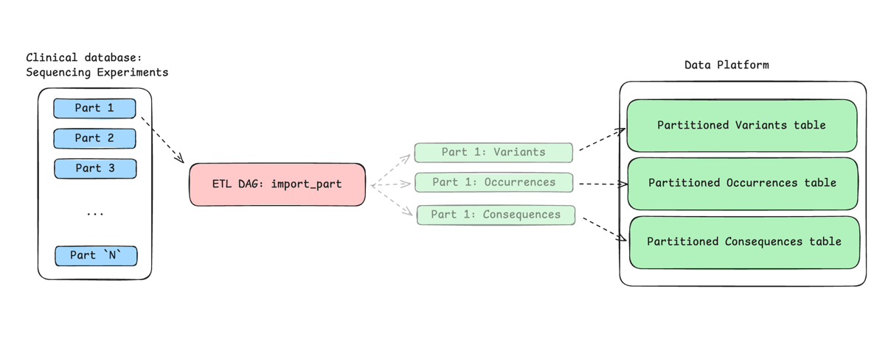
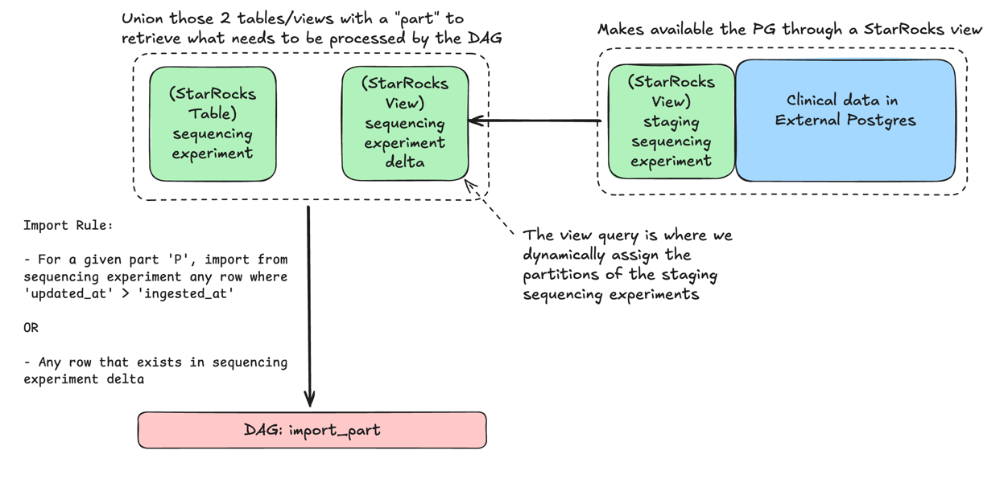

## Radiant ETL pipelines

## What is a partition?

A partition in the Radiant context refers to the arbitrarily defined subset of data that exist in the clinical data model. 

We define partitions because genomic data is often too large to be processed in a single step. 
 By breaking the data into smaller, manageable partitions, we can efficiently import it into the data platform.

*(For illustration purposes, some tables were removed from the diagram below, but they are still part of the partition.)*

## What are the impacts of partitioning on the business logic?

- Occurrences are partitioned by the partition id.
- Variants partitioned are based on the partition id. 
- Consequences filter partitioned are partitioned by the partition id.
- Variant frequencies are updated based on the partition id and then aggregated at the global level.

## How do we define a partition?

### Partitioning Strategy

Partitions are assigned based on the `experimental_strategy` (e.g., WGS, WXS). Each strategy has a specific starting partition ID (mask) and a limit on the number of experiments per partition.

| Strategy                          | First partition mask | Limit (per partition) |
|:----------------------------------|:---------------------|:----------------------|
| **WGS** (Whole Genome Sequencing) | `0x00000000` (0)     | 100                   |
| **WXS** (Whole Exome Sequencing)  | `0x00010000` (65536) | 1000                  |

**Note on the limit**: This limit doesn't represent a number of whole genomes (or exomes) but rather a number of tasks that are allowed to be processed in a single partition. This is a soft-limit, meaning the number might be exceeded if there's a match with cases, sequencing experiment, patient or family IDs. The limit is primarily used to determine when to start a new partition for new experiments that don't have any existing relationships.

### Assignment Logic

The assigner follows these rules to ensure consistency and efficiency:

1.  **Consistency Check**: It first checks if a partition has already been assigned for any of the following IDs associated with the sequencing experiment:
    *   `patient_id`
    *   `seq_id`
    *   `case_id`
    *   `family_id`
    *   This is represented in the `staging_sequencing_experiment_delta` view in columns: `patient_part`, `seq_part`, `case_part` or `family_part`.

2.  **Reuse Existing Partition**: If any of the above IDs are already associated with a partition, that partition ID is reused for the current experiment. This ensures that all experiments belonging to the same patient or family are grouped into the same partition.
    *   **Inconsistency Warning**: If multiple different partition IDs are found for the same group of related IDs, the process will raise a `ValueError` to prevent data corruption.

3.  **New Partition Assignment**: If no existing partition is found:
    *   The experiment is assigned to the current active partition for its strategy.
    *   The count of experiments in that partition is incremented.
    *   If the partition reaches its limit (e.g., 100 for WGS), a new partition ID is generated (current ID + 1) and the count is reset.

### Data Flow

1.  **Fetch Delta**: `[StarRocks] Get Sequencing Experiment Delta` fetches new or updated sequencing experiments from the staging delta table.
2.  **Assign Partitions**: `[PyOp] Assign Partitions` processes the experiments through `SequencingExperimentPartitionAssigner`.
3.  **Insert/Update**: `[PyOp] Insert New Sequencing Experiments` saves the experiments with their newly assigned `part` IDs back to the StarRocks `sequencing_experiment` table.
4.  **Trigger Import**: The `radiant-import` DAG then uses these partitions to trigger the `import-part` DAG for each partition in order of priority.

## How we determine what is imported on DAG runs ? 

