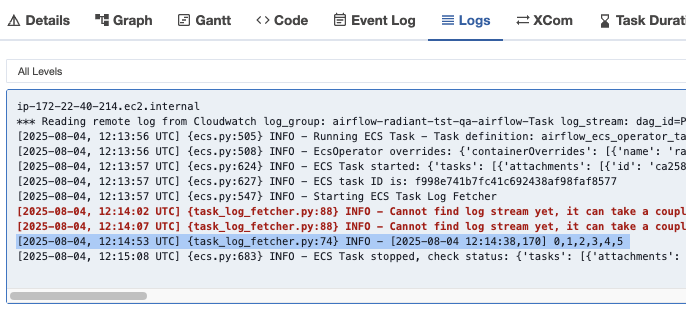

# POC: ECS & K8S operators for Airflow

## Context

Running the radiant tasks in MWAA operators is not efficient due to the cost of MWAA.
This POC aims to explore the feasibility of running the radiant tasks in ECS and K8S operators for Airflow.

This is done with the aim of reducing costs and improving scalability of the pipeline. 

Because of the wide availability of tools to support Kubernetes-like operators, 
other aspects of the pipeline will be easier to operate, such as accessing the logs and metrics of each of the operators.

## External K8s Setup

> **Note**
> This section is only relevant if you want to run the Airflow tasks in an external Kubernetes
> cluster (e.g., Minikube). If you are running Airflow inside Kubernetes, you can use the "In cluster" mode in Airflow
> and skip this section.

First, we need to set up a local Kubernetes cluster to run the Airflow tasks.

The following sections contains the necessary steps to set up a local Kubernetes cluster using Minikube and configure Airflow to connect to it.

### 1. Kubectl

1. Install kubectl: https://kubernetes.io/docs/tasks/tools/install-kubectl/

### 2. Minikube

1. Install Minikube: https://minikube.sigs.k8s.io/docs/start/
2. Start Minikube: `minikube start`

### 3. Airflow Kubernetes Connection (for external K8S cluster)

1. Copy the local `.minikube` directory to the `dkr_fs` directory: `cp -r ~/.minikube/* dkr_fs/.minikube/` 
2. Extract the kube config to a JSON file:

```
kubectl config view --raw -o json > tmp_config.json
```

3. Replace the `/home/*` (or `/Users/*` on Mac) paths in JSON config with `/home/radiant/...`
4. Replace `localhost` (or `127.0.0.1`) with `host.docker.internal` (or `172.17.0.1` on Linux) in the JSON config. This allows Airflow running in Docker to access the Minikube cluster.
5. In the `.json` config, replace the line similar to:`

```
"certificate-authority": "/Users/myuser/.minikube/ca.crt",
```

With:

```
"insecure-skip-tls-verify": true
```

> **Note**
> 
> This is a workaround to avoid certificate issues between Airflow and Minikube. In production, you should use proper certificates.

6. Create a new Airflow Connection in the Airflow UI with the following specifications:

- Connection Id: `kubernetes_conn`
- Connection Type: `Kubernetes Cluster Connection`
- Kube config (JSON format): Paste the modified JSON content from `tmp_config.json`
- Disable SSL: Checked

Leave the other fields as default.

### 4. Building the Docker Image for Minikube

The minikube cluster has its own Docker repository. We need to build the operator's image in this repository.

1. Set the Docker environment to use Minikube's Docker daemon:

```bash
eval $(minikube -p minikube docker-env)
```

2. Build the operator's Docker image:

```bash
make build-docker-k8s-operator
```

### 5. Running a DAG with Kubernetes Operator

There are 2 ways to test the Kubernetes operator in Airflow:

1. Running the `POC-ecs-k8s-operators` DAG will run a single task and displays logs and XCom in the Airflow UI.
2. The `import-vcf` DAG was updated to instead use the `KubernetesPodOperator` tasks.
It's currently configured to run 1 pod per case. Running the global `import-radiant` DAG will trigger the Kubernetes operator when its scheduling
the `import-part` DAG. 

**Important**: DAGs will be destroyed once the task is completed. To view the logs, you need to check the Airflow UI.

## ECS Setup

> **Note**
> 
> It's not possible to test this locally unless you have access to a lot like LocalStack (https://www.localstack.cloud/).
> This section is only relevant if you have access to and AWS account.

### Components checklist

**It's best practice to use Infrastructure as Code (IaC) tools like Terraform or AWS CloudFormation to set up the necessary components.**

- [ ] ECR Image Repository for the ECS operator's image
  - Use the `Dockerfile-vcf-operator` to build the image and push it to ECR.
- [ ] Updated IAM roles & policies to perform necessary actions
  - Follow documentation: https://airflow.apache.org/docs/apache-airflow-providers-amazon/stable/operators/ecs.html
  - You should end up with 3 IAM roles:
    - Airflow role
    - ECS execution role
    - ECS task role
- [ ] Create an ECS task definition (that you Aiflow Operator will use)
- [ ] Create an AWS Connection named in Airflow (with appropriate config depending on your environment)

### Logs & XComs

**Logs**:

There's a bug in the Airflow ECS operator (for the MWAA supported version) that required the name of the image to be added in the 
awslogs_prefix field of the task definition when requiring CloudWatch logs to be browsed through the Airflow UI.

```
awslogs_group="apps-qa/radiant-etl",
awslogs_region="us-east-1",
awslogs_stream_prefix="ecs/radiant-operator-qa-etl-container",
```

**XComs**:

XComs and parameters configuration are available for ECS operators. Input XCom are passed as any other airflow operator, however
output XComs are generated from the last logging message of the task.

Example with the `poc_ecs_operator` DAG:

- Using `count_to = 5` as the DAG parameter value:


- The DAG runs a single task that counts to 5 and logs the result:


- XComs are available as the `return_value` as a string from the last logging message of the task:


- CloudWatch logs are available in the Airflow UI:

