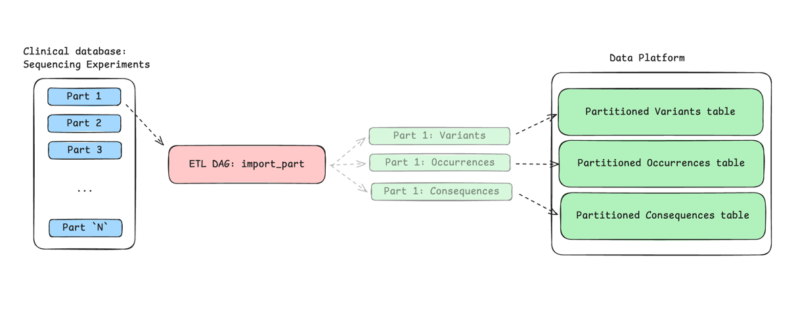
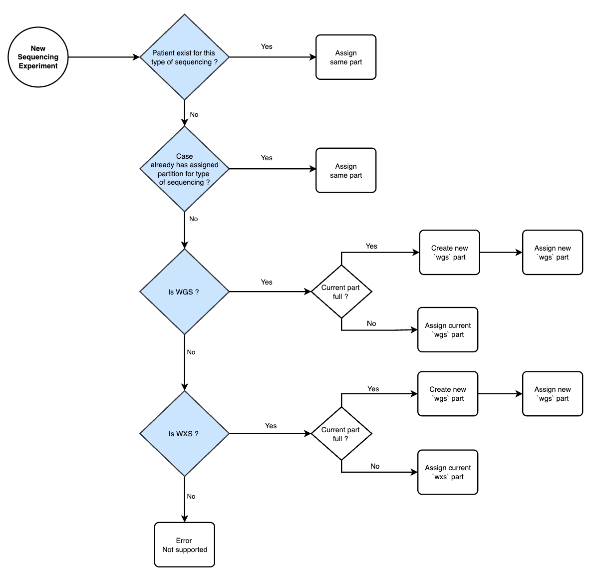

# Importing a partition in Radiant

## What is a partition?

A partition in the Radiant context refers to the arbitrarily defined subset of data that exist in the clinical data model. 

We define partitions because genomic data is often too large to be processed in a single step. 
 By breaking the data into smaller, manageable partitions, we can efficiently import it into the data platform.

*(For illustration purposes, some tables were removed from the diagram below, but they are still part of the partition.)*

## What are the impacts of partitioning on the business logic?

- Occurrences are partitioned by the partition id.
- Variants partitioned are based on the partition id. 
- Consequences filter partitioned are partitioned by the partition id.
- Variant frequencies are updated based on the partition id and then aggregated at the global level.

## How do we define a partition?

## How we determine what is imported on DAG runs ? 

(WIP)

